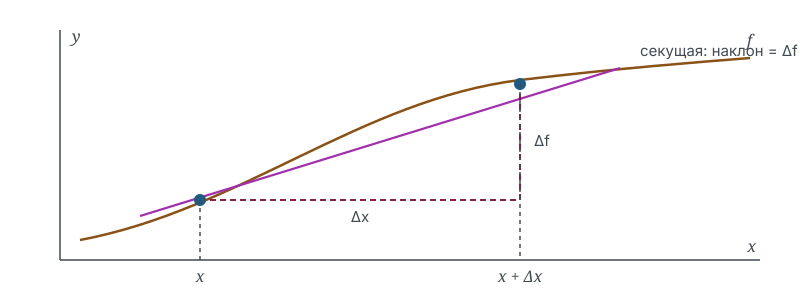

# Производная как скорость изменения

## Зачем это нужно

Средняя скорость на участке пути считается делением: расстояние на время. Но спидометр показывает скорость **в точке**, а за нулевое время проходится нулевое расстояние, и деление ноля на ноль смысла не имеет.

Производная — способ придать этому делению смысл. Приём тот же, что и всюду в анализе: невозможную величину заменяют пределом возможных.

## Обозначения

| Символ | Значение | Роль |
|--------|----------|------|
| $x$ | точка, в которой ищем скорость | `variable` |
| $\Delta x$ | приращение аргумента | `variable` |
| $f$ | исследуемая функция | `function` |
| $f'(x)$ | производная в точке $x$ | `operator` |
| $k$ | угловой коэффициент прямой | `target` |

## Средняя скорость: то, что мы умеем считать

Возьмём два значения аргумента: $\enfVar{x}$ и $\enfVar{x} + \Delta \enfVar{x}$. Функция изменилась на $\enfFun{f}(\enfVar{x} + \Delta \enfVar{x}) - \enfFun{f}(\enfVar{x})$, аргумент — на $\Delta \enfVar{x}$. Отношение этих приращений

$$
\frac{\enfFun{f}(\enfVar{x} + \Delta \enfVar{x}) - \enfFun{f}(\enfVar{x})}{\Delta \enfVar{x}}
$$

называется **средней скоростью изменения** функции на отрезке. Геометрически это угловой коэффициент $\enfTgt{k}$ секущей — прямой, проведённой через две точки графика.

Пока всё определено: $\Delta \enfVar{x} \neq 0$, деление законно.

## От средней скорости к мгновенной

Теперь начнём сближать точки. Секущая поворачивается, и её наклон меняется. Вопрос: стремится ли он к чему-то определённому?

> [!definition] Определение 1. Производная
> **Производной** (derivative) функции $\enfFun{f}$ в точке $\enfVar{x}$ называется предел отношения приращения функции к приращению аргумента при стремлении последнего к нулю:
> $$\enfOp{f'}(\enfVar{x}) = \lim_{\Delta x \to 0} \frac{\enfFun{f}(\enfVar{x} + \Delta \enfVar{x}) - \enfFun{f}(\enfVar{x})}{\Delta \enfVar{x}},$$
> если этот предел существует и конечен. В этом случае функцию называют дифференцируемой в точке $\enfVar{x}$.

Здесь работает то самое свойство предела, ради которого точка исключается из рассмотрения: $\Delta \enfVar{x}$ стремится к нулю, но нулём никогда не становится, поэтому дробь всё время имеет смысл. Деление ноля на ноль так и не выполняется — оно заменено предельным переходом.

> [!intuition] Геометрический смысл
> Производная — угловой коэффициент касательной к графику в данной точке. Касательная при этом определяется **через** производную, а не наоборот: «прямая, касающаяся графика в одной точке» — не определение, поскольку прямая может касаться графика в одной точке, не будучи касательной, и наоборот.

## Вычисление по определению

Найдём производную $\enfFun{f}(\enfVar{x}) = \enfVar{x}^2$ в произвольной точке.

**Шаг 1.** Выпишем приращение функции:

$$
\enfFun{f}(\enfVar{x} + \Delta \enfVar{x}) - \enfFun{f}(\enfVar{x}) = (\enfVar{x} + \Delta \enfVar{x})^2 - \enfVar{x}^2.
$$

**Шаг 2.** Раскроем квадрат суммы и приведём подобные:

$$
(\enfVar{x} + \Delta \enfVar{x})^2 - \enfVar{x}^2 = \enfVar{x}^2 + 2\enfVar{x}\,\Delta \enfVar{x} + (\Delta \enfVar{x})^2 - \enfVar{x}^2 = 2\enfVar{x}\,\Delta \enfVar{x} + (\Delta \enfVar{x})^2.
$$

**Шаг 3.** Разделим на $\Delta \enfVar{x}$. Деление законно, поскольку по определению предела $\Delta \enfVar{x} \neq 0$:

$$
\frac{2\enfVar{x}\,\Delta \enfVar{x} + (\Delta \enfVar{x})^2}{\Delta \enfVar{x}} = 2\enfVar{x} + \Delta \enfVar{x}.
$$

**Шаг 4.** Перейдём к пределу. Выражение $2\enfVar{x} + \Delta \enfVar{x}$ непрерывно по $\Delta \enfVar{x}$, поэтому предел равен значению при нуле:

$$
\enfOp{f'}(\enfVar{x}) = \lim_{\Delta x \to 0}\left(2\enfVar{x} + \Delta \enfVar{x}\right) = 2\enfVar{x}. \qquad \blacksquare
$$

Проверка: при $\enfVar{x} = 3$ получаем $\enfOp{f'}(3) = 6$. Посчитаем среднюю скорость на маленьком отрезке: при $\Delta x = 0{,}01$ отношение равно $2 \cdot 3 + 0{,}01 = 6{,}01$ — близко к 6, как и должно быть.

## Дифференцируемость сильнее непрерывности

> [!theorem] Теорема 2
> Если функция дифференцируема в точке, то она в этой точке непрерывна. Обратное неверно.

> [!proof] Доказательство
> Пусть производная существует. Запишем приращение функции как произведение:
> $$\enfFun{f}(\enfVar{x} + \Delta \enfVar{x}) - \enfFun{f}(\enfVar{x}) = \frac{\enfFun{f}(\enfVar{x} + \Delta \enfVar{x}) - \enfFun{f}(\enfVar{x})}{\Delta \enfVar{x}} \cdot \Delta \enfVar{x}.$$
> Преобразование законно при $\Delta x \neq 0$, что и рассматривается. При $\Delta \enfVar{x} \to 0$ первый множитель по условию стремится к конечному числу $\enfOp{f'}(\enfVar{x})$, второй — к нулю. По теореме о пределе произведения предел равен $\enfOp{f'}(\enfVar{x}) \cdot 0 = 0$, то есть приращение функции стремится к нулю — это и есть непрерывность.
>
> Обратное неверно: функция $\enfFun{f}(\enfVar{x}) = |\enfVar{x}|$ непрерывна в нуле, но отношение приращений равно $+1$ при $\Delta x > 0$ и $-1$ при $\Delta x < 0$, поэтому предела не имеет. $\blacksquare$

> [!remark] Что означает контрпример
> Дифференцируемость — требование гладкости: у графика в точке есть единственная касательная. У модуля в нуле «угол», и касательных естественных кандидатов две. Непрерывность запрещает разрывы, но не запрещает изломы.

## Что стоит запомнить

1. Производная — предел отношения приращений, а не «деление бесконечно малых»: деление на ноль так и не выполняется.
2. Геометрически производная — угловой коэффициент касательной; сама касательная определяется через производную.
3. Вычисление по определению всегда состоит из четырёх шагов: приращение, упрощение, деление, предельный переход.
4. Дифференцируемость влечёт непрерывность, но не наоборот: излом непрерывность не нарушает, а дифференцируемость нарушает.
5. Существование производной — утверждение о существовании предела, поэтому все способы доказать отсутствие предела годятся и здесь.

## Проверка себя

1. Найдите по определению производную функции $f(x) = 3x + 5$. Почему ответ не зависит от точки?
2. Найдите по определению производную $f(x) = 1/x$ при $x \neq 0$. В каком шаге понадобилось условие $x \neq 0$, а в каком — $\Delta x \neq 0$?
3. Функция непрерывна на всей прямой, но не дифференцируема ровно в двух точках. Нарисуйте её график.
4. Отношение приращений функции в точке стремится к $+\infty$. Дифференцируема ли функция в этой точке? Есть ли у графика касательная?
5. Приведите пример функции, дифференцируемой в одной-единственной точке.

## Что дальше

- [Производная в сжатом изложении](Derivative.publication.md) — тот же материал в Publication Mode
- [Определённый интеграл](Integral.learning.md) — обратная задача: восстановить функцию по скорости
