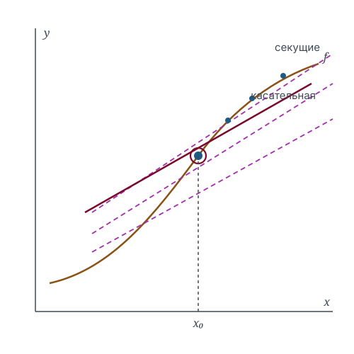

# Производная как скорость изменения

Понятие предела, введённое в главе 2, применяется здесь к первой содержательной задаче: определению мгновенной скорости изменения функции. Полученная конструкция — производная — служит основой всего дифференциального исчисления.

## Обозначения

| Символ | Значение | Роль | Введён |
|--------|----------|------|--------|
| $x$, $\Delta x$ | точка и приращение аргумента | `variable` | здесь |
| $f$ | функция вещественной переменной | `function` | гл. 1.3 |
| $f'$ | производная | — | здесь |

## 3.1. Определение

Отношение приращения функции к приращению аргумента

$$
\frac{\enfFun{f}(\enfVar{x} + \Delta \enfVar{x}) - \enfFun{f}(\enfVar{x})}{\Delta \enfVar{x}}
$$

определено при $\Delta \enfVar{x} \neq 0$ и равно угловому коэффициенту секущей, проходящей через точки графика с абсциссами $\enfVar{x}$ и $\enfVar{x} + \Delta \enfVar{x}$.

> [!definition] Определение 3.1. Производная
> Производной функции $\enfFun{f}$ в точке $\enfVar{x}$ называется предел
> $$f'(\enfVar{x}) = \lim_{\Delta x \to 0} \frac{\enfFun{f}(\enfVar{x} + \Delta \enfVar{x}) - \enfFun{f}(\enfVar{x})}{\Delta \enfVar{x}},$$
> если он существует и конечен. Функция, имеющая производную в точке, называется дифференцируемой в ней.

Определение опирается на исключение предельной точки из рассмотрения (определение 2.1): величина $\Delta \enfVar{x}$ стремится к нулю, не принимая этого значения, поэтому отношение определено на всём протяжении предельного перехода.

> [!definition] Определение 3.2. Касательная
> Касательной к графику функции $\enfFun{f}$ в точке $\enfVar{x_0}$ называется прямая с угловым коэффициентом $f'(\enfVar{x_0})$, проходящая через точку $(\enfVar{x_0}, \enfFun{f}(\enfVar{x_0}))$.

Порядок определений существен: касательная вводится через производную, а не наоборот. Описание «прямая, имеющая с графиком одну общую точку» не годится ни как определение, ни как критерий — оно и не необходимо, и не достаточно.

> [!example] Пример 3.3
> Для $\enfFun{f}(\enfVar{x}) = \enfVar{x}^2$ приращение равно $2\enfVar{x}\,\Delta \enfVar{x} + (\Delta \enfVar{x})^2$; после деления на $\Delta \enfVar{x}$ получаем $2\enfVar{x} + \Delta \enfVar{x}$, откуда $f'(\enfVar{x}) = 2\enfVar{x}$.

## 3.2. Связь с непрерывностью

> [!theorem] Теорема 3.4
> Дифференцируемость в точке влечёт непрерывность в ней. Обратное неверно.

> [!proof] Доказательство
> При $\Delta \enfVar{x} \neq 0$ справедливо тождество
> $$\enfFun{f}(\enfVar{x} + \Delta \enfVar{x}) - \enfFun{f}(\enfVar{x}) = \frac{\enfFun{f}(\enfVar{x} + \Delta \enfVar{x}) - \enfFun{f}(\enfVar{x})}{\Delta \enfVar{x}} \cdot \Delta \enfVar{x}.$$
> По условию первый множитель имеет конечный предел, второй стремится к нулю; по теореме о пределе произведения приращение функции стремится к нулю, что равносильно непрерывности.
>
> Обратное утверждение опровергается функцией $\enfFun{f}(\enfVar{x}) = |\enfVar{x}|$: она непрерывна в нуле, однако отношение приращений равно $\operatorname{sign}(\Delta \enfVar{x})$ и предела при $\Delta \enfVar{x} \to 0$ не имеет. $\blacksquare$

> [!intuition] Содержательное различие
> Непрерывность запрещает разрывы, дифференцируемость — ещё и изломы. Существование производной означает, что вблизи точки функция с точностью до бесконечно малой более высокого порядка ведёт себя как линейная.

## Итоги раздела

Производная определена как предел отношения приращений и допускает два равноправных прочтения: кинематическое — мгновенная скорость изменения, и геометрическое — угловой коэффициент касательной. Конструкция корректна благодаря тому, что предел рассматривается в проколотой окрестности: деление на нулевое приращение нигде не выполняется. Дифференцируемость строго сильнее непрерывности, и разрыв между этими свойствами обнаруживается уже на функции модуля.

## Упражнения

**3.1.** Найдите по определению производную функции $f(x) = 1/x$ при $x \neq 0$ и укажите, где в выкладке используется условие $x \neq 0$, а где — $\Delta x \neq 0$.

**3.2.** Постройте функцию, непрерывную на $\mathbb{R}$ и не дифференцируемую ровно в точках $x = 1$ и $x = 2$.

**3.3.** Пусть отношение приращений стремится к $+\infty$. Дифференцируема ли функция? Существует ли у графика касательная в смысле определения 3.2?

**3.4.** Докажите, что функция $f(x) = x^2\sin(1/x)$ при $x \neq 0$ и $f(0) = 0$ дифференцируема в нуле, а её производная разрывна в этой точке.

**3.5.** Приведите пример функции, дифференцируемой ровно в одной точке.

## Библиографические замечания

Определение производной через предел отношения приращений и его связь с задачей о касательной изложены в любом стандартном курсе анализа. Пример из упражнения 3.4 — классическая иллюстрация того, что производная дифференцируемой функции не обязана быть непрерывной.
