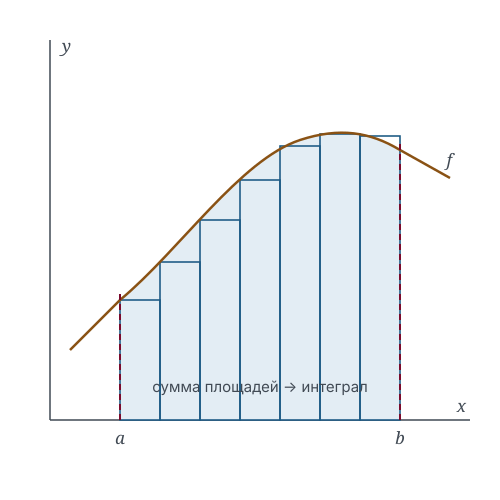

# Определённый интеграл как предел интегральных сумм

Дифференцирование, изученное в главе 3, решает задачу о скорости изменения. Здесь строится конструкция, решающая обратную по смыслу задачу — о суммарном накоплении, и определяемая, как и производная, через предельный переход.

## Обозначения

| Символ | Значение | Роль | Введён |
|--------|----------|------|--------|
| $x_i$, $\xi_i$ | точки разбиения и промежуточные точки | `variable` | здесь |
| $f$ | подынтегральная функция | `function` | гл. 1.3 |
| $\Delta x_i$, $\lambda$ | длины отрезков и мелкость разбиения | `parameter` | здесь |

## 5.1. Разбиение и интегральная сумма

> [!definition] Определение 5.1. Разбиение
> Разбиением отрезка $[a, b]$ называется конечный набор точек $a = \enfVar{x_0} < \enfVar{x_1} < \dots < \enfVar{x_n} = b$. Величины $\enfPar{\Delta x_i} = \enfVar{x_i} - \enfVar{x_{i-1}}$ называются длинами отрезков разбиения, а $\enfPar{\lambda} = \max_i \enfPar{\Delta x_i}$ — его мелкостью.

> [!definition] Определение 5.2. Интегральная сумма
> Интегральной суммой Римана функции $\enfFun{f}$, отвечающей разбиению и набору промежуточных точек $\enfVar{\xi_i} \in [\enfVar{x_{i-1}}, \enfVar{x_i}]$, называется
> $$S = \sum_{i=1}^{n} \enfFun{f}(\enfVar{\xi_i})\,\enfPar{\Delta x_i}.$$

## 5.2. Определение интеграла

> [!definition] Определение 5.3. Определённый интеграл
> Число $I$ называется определённым интегралом функции $\enfFun{f}$ по отрезку $[a, b]$, если для любого $\varepsilon > 0$ найдётся $\delta > 0$ такое, что для любого разбиения мелкости $\enfPar{\lambda} < \delta$ и любого набора промежуточных точек выполняется $|S - I| < \varepsilon$. Обозначение: $I = \int_a^b \enfFun{f}(\enfVar{x})\,\mathrm{d}\enfVar{x}$.

Двойное «любого» существенно. Независимость предела от разбиения и от выбора промежуточных точек — это то, что превращает интеграл в характеристику функции, а не в характеристику способа вычисления.

> [!remark] Замечание 5.4. Мелкость, а не число отрезков
> Условие $\enfPar{\lambda} \to 0$ не равносильно условию $n \to \infty$. Добавляя точки лишь в левой половине отрезка, можно получить последовательность разбиений с $n \to \infty$ и $\enfPar{\lambda} \geq (b-a)/2$. Сходимость интегральных сумм в такой последовательности ничего не означает.

> [!example] Пример 5.5
> Для $\enfFun{f}(\enfVar{x}) = \enfVar{x}$ на $[0,1]$ равномерное разбиение с промежуточными точками в правых концах даёт
> $$S_n = \sum_{i=1}^n \frac{i}{n}\cdot\frac{1}{n} = \frac{n+1}{2n} \xrightarrow[n \to \infty]{} \frac{1}{2},$$
> что согласуется с площадью треугольника с катетами, равными единице.

## 5.3. Условия интегрируемости

> [!theorem] Теорема 5.6
> Непрерывная на отрезке функция интегрируема на нём.

Доказательство опирается на равномерную непрерывность (теорема Кантора, раздел 2.5) и приводится в приложении B. Условие достаточно, но не необходимо: интегрируема и функция с конечным числом разрывов первого рода, поскольку вклад окрестностей точек разрыва в интегральную сумму имеет порядок $\enfPar{\lambda}$.

> [!example] Пример 5.7. Неинтегрируемая функция
> Функция Дирихле, равная единице в рациональных точках и нулю в иррациональных, не интегрируема на $[0,1]$: выбор рациональных промежуточных точек даёт $S = 1$ при любом разбиении, выбор иррациональных — $S = 0$. Требование независимости от выбора точек нарушено.

## Итоги раздела

Определённый интеграл введён как предел интегральных сумм при измельчении разбиения, причём предел обязан существовать равномерно по всем разбиениям заданной мелкости и по всем наборам промежуточных точек. Это двойное требование отделяет интегрируемые функции от неинтегрируемых и иллюстрируется функцией Дирихле. Непрерывности достаточно для интегрируемости; вычисление же непосредственно по определению громоздко даже для линейной функции, что и мотивирует переход к формуле Ньютона — Лейбница в следующем разделе.

## Упражнения

**5.1.** Вычислите $\int_0^1 x^2\,\mathrm{d}x$ по определению 5.3.

**5.2.** Постройте последовательность разбиений $[0,1]$ с $n \to \infty$ и $\lambda \to 1/2$.

**5.3.** Докажите, что функция, равная нулю всюду на $[0,1]$ кроме одной точки, интегрируема, и вычислите интеграл.

**5.4.** Покажите, что из интегрируемости $f$ следует её ограниченность на отрезке.

**5.5.** Пусть $f$ и $g$ интегрируемы. Докажите интегрируемость $f + g$ непосредственно из определения 5.3.

## Библиографические замечания

Изложение следует построению Римана. Критерий интегрируемости в терминах сумм Дарбу и характеризация Лебега через меру множества точек разрыва рассматриваются в главе 9.
