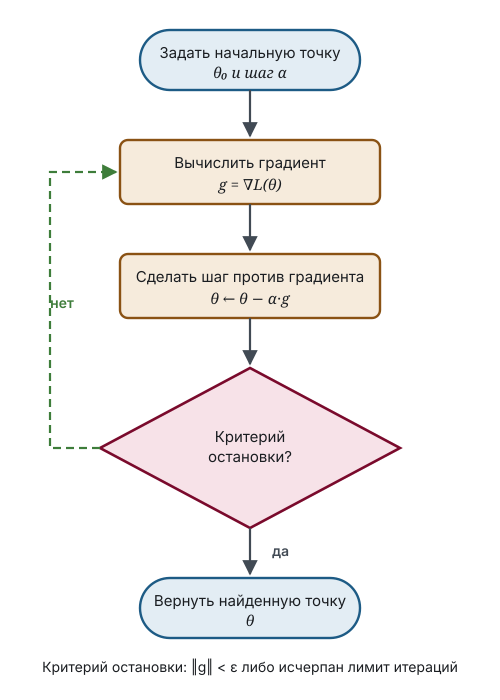

# Q-Learning: обучение без модели среды

## Зачем это нужно

Уравнение Беллмана позволяет вычислить ценности состояний — но только если известны вероятности переходов $P(s' \mid s, a)$ и функция награды. В реальных задачах их нет: робот не знает заранее, чем закончится попытка повернуть, а игрок не знает распределения ходов соперника.

Возникает вопрос: можно ли научиться действовать оптимально, не зная модели среды и не пытаясь её восстановить?

Q-Learning отвечает утвердительно. Идея в том, чтобы заменить усреднение по неизвестному распределению усреднением по фактически произошедшим переходам.

## Обозначения

| Символ | Значение | Роль |
|--------|----------|------|
| $s$, $s'$ | текущее состояние и состояние-преемник | `variable` |
| $a$, $a'$ | текущее и следующее действие | `function` |
| $r$ | полученная награда | `target` |
| $Q(s, a)$ | оценка ценности пары «состояние — действие» | `operator` |
| $\alpha \in (0, 1]$ | скорость обучения (learning rate) | `parameter` |
| $\gamma \in [0, 1)$ | коэффициент дисконтирования | `parameter` |
| $\varepsilon$ | доля случайных действий при исследовании | `parameter` |

## Функция ценности действия

Ценности состояний $V(s)$ недостаточно, чтобы выбрать действие: зная, насколько хорошо состояние, агент всё равно не знает, каким действием туда попасть, — для этого нужна модель переходов.

Поэтому вводят величину, привязанную сразу к паре:

$$
\enfOp{Q}(\enfVar{s}, \enfFun{a}) = \text{ожидаемая отдача, если в состоянии } \enfVar{s} \text{ сделать } \enfFun{a}, \text{ а дальше действовать оптимально.}
$$

Из $\enfOp{Q}$ политика извлекается без всякой модели: в каждом состоянии выбирается действие с наибольшим значением. Это ключевое преимущество и причина, по которой работают именно с $Q$, а не с $V$.

Уравнение оптимальности Беллмана для $\enfOp{Q}$ выглядит так:

$$
\enfOp{Q^*}(\enfVar{s}, a) = \mathbb{E}\Bigl[\enfTgt{r} + \enfPar{\gamma}\max_{a'} \enfOp{Q^*}(\enfVar{s'}, a')\Bigr].
$$

Максимум внутри ожидания и означает «дальше действовать оптимально». Действие здесь оставлено нейтральным: разбирается структура правой части, а не выбор действия, и четырёх тонов для этого достаточно.

## Как убрать ожидание

Вычислить ожидание нельзя: распределение $\enfVar{s'}$ неизвестно. Но агент может получить **одну реализацию**: совершить действие и посмотреть, что случилось. Наблюдение даёт четвёрку $(\enfVar{s}, \enfFun{a}, \enfTgt{r}, \enfVar{s'})$, из которой строится оценка правой части уравнения:

$$
\enfTgt{y} = \enfTgt{r} + \enfPar{\gamma}\max_{a'} \enfOp{Q}(\enfVar{s'}, a').
$$

Эта величина называется **целью** (target). Она случайна и потому шумна: одно наблюдение — плохая оценка ожидания. Но если двигать текущую оценку в сторону цели небольшими шагами, шум усреднится сам собой.

> [!definition] Определение 1. Правило обновления Q-Learning
> $$\enfOp{Q}(\enfVar{s}, a) \leftarrow \enfOp{Q}(\enfVar{s}, a) + \enfPar{\alpha}\Bigl[\underbrace{\enfTgt{r} + \enfPar{\gamma}\max_{a'} \enfOp{Q}(\enfVar{s'}, a') - \enfOp{Q}(\enfVar{s}, a)}_{\text{ошибка временного различия}}\Bigr].$$

> [!intuition] Как читать правило
> Выражение в скобках — разница между тем, что мы теперь думаем о ценности пары, и тем, что думали раньше. Если разница положительна, пара оказалась лучше ожидаемого, и оценка растёт. Скорость обучения $\enfPar{\alpha}$ определяет доверие к одному наблюдению: при $\alpha = 1$ старая оценка выбрасывается целиком, при малых $\alpha$ она меняется еле-еле. Правило можно переписать как $Q \leftarrow (1-\alpha)Q + \alpha y$ — это скользящее среднее старой оценки и новой цели.

## Дилемма исследования и использования

Чтобы выбрать лучшее действие, нужно знать ценности всех действий. Чтобы узнать ценность действия, нужно его совершить. Агент, всегда выбирающий текущее лучшее, никогда не проверит остальные и может навсегда застрять на первом попавшемся приемлемом варианте.

Стандартное решение — $\enfPar{\varepsilon}$-жадная стратегия: с вероятностью $1 - \enfPar{\varepsilon}$ выбирается действие с максимальным $\enfOp{Q}$, с вероятностью $\enfPar{\varepsilon}$ — случайное.

> [!remark] Обучение вне политики
> Q-Learning обладает важным свойством: в правиле обновления стоит $\max_{a'}$, то есть цель строится по оптимальному действию, а не по тому, которое агент действительно совершит на следующем шаге. Поэтому агент может исследовать среду как угодно и всё равно сходиться к оптимальной оценке. Алгоритмы с таким свойством называются работающими вне политики (off-policy).

## Алгоритм целиком

```text
инициализировать Q(s, a) произвольно, для терминальных состояний нулём
для каждого эпизода:
    s ← начальное состояние
    пока s не терминально:
        a ← ε-жадный выбор по Q(s, ·)
        совершить a, наблюдать r и s'
        Q(s, a) ← Q(s, a) + α [ r + γ·max Q(s', ·) − Q(s, a) ]
        s ← s'
```



## Разобранный пример

Три состояния в ряд: $\enfVar{A} \to \enfVar{B} \to \enfVar{C}$, где $\enfVar{C}$ терминально. Одно действие «вперёд». Награда 0 за переход из $\enfVar{A}$ в $\enfVar{B}$ и 10 за переход из $\enfVar{B}$ в $\enfVar{C}$. Параметры: $\enfPar{\alpha} = 0{,}5$, $\enfPar{\gamma} = 0{,}9$. Все оценки изначально нулевые.

**Эпизод 1.** Переход $\enfVar{A} \to \enfVar{B}$, награда 0. Цель: $0 + 0{,}9 \cdot \max \enfOp{Q}(\enfVar{B}, \cdot) = 0 + 0{,}9 \cdot 0 = 0$. Обновление: $\enfOp{Q}(\enfVar{A}) \leftarrow 0 + 0{,}5(0 - 0) = 0$. Ничего не изменилось.

Переход $\enfVar{B} \to \enfVar{C}$, награда 10. Состояние $\enfVar{C}$ терминально, его ценность равна нулю. Цель: $10 + 0{,}9 \cdot 0 = 10$. Обновление: $\enfOp{Q}(\enfVar{B}) \leftarrow 0 + 0{,}5(10 - 0) = 5$.

**Эпизод 2.** Переход $\enfVar{A} \to \enfVar{B}$. Теперь $\max \enfOp{Q}(\enfVar{B}, \cdot) = 5$, цель равна $0 + 0{,}9 \cdot 5 = 4{,}5$. Обновление: $\enfOp{Q}(\enfVar{A}) \leftarrow 0 + 0{,}5(4{,}5 - 0) = 2{,}25$.

Переход $\enfVar{B} \to \enfVar{C}$: цель снова 10, обновление $\enfOp{Q}(\enfVar{B}) \leftarrow 5 + 0{,}5(10 - 5) = 7{,}5$.

**Эпизод 3.** $\enfOp{Q}(\enfVar{A}) \leftarrow 2{,}25 + 0{,}5(0{,}9 \cdot 7{,}5 - 2{,}25) = 2{,}25 + 0{,}5 \cdot 4{,}5 = 4{,}5$. И $\enfOp{Q}(\enfVar{B}) \leftarrow 7{,}5 + 0{,}5(10 - 7{,}5) = 8{,}75$.

Видно главное: информация о награде распространяется назад по цепочке на одно звено за эпизод. Точные значения — $\enfOp{Q}(\enfVar{B}) = 10$ и $\enfOp{Q}(\enfVar{A}) = 0{,}9 \cdot 10 = 9$; оценки к ним приближаются, но не достигают за конечное число шагов при постоянном $\alpha$.

## Условия сходимости

> [!theorem] Теорема 2. Сходимость Q-Learning
> Если каждая пара «состояние — действие» посещается бесконечно часто, а скорость обучения удовлетворяет условиям $\sum_t \alpha_t = \infty$ и $\sum_t \alpha_t^2 < \infty$, то оценки сходятся к $Q^*$ с вероятностью единица.

> [!intuition] Смысл условий на скорость обучения
> Первое условие требует, чтобы суммарный «путь» обучения был неограничен: иначе оценка остановится, не дойдя до цели. Второе требует, чтобы шаги убывали достаточно быстро и шум отдельных наблюдений затухал. Обоим условиям удовлетворяет, например, $\alpha_t = 1/t$, а постоянное $\alpha$ — только первому. Именно поэтому в примере выше оценки колеблются вокруг истинных значений, а не сходятся к ним точно.

## Что стоит запомнить

1. $Q$ используется вместо $V$ потому, что из неё политика извлекается без модели среды.
2. Ожидание в уравнении Беллмана заменяется одной наблюдённой реализацией, а шум гасится малым шагом обучения.
3. Ошибка временного различия — разница между новой и старой оценкой; правило обновления есть скользящее среднее.
4. Максимум в цели делает алгоритм работающим вне политики: исследовать можно как угодно.
5. Информация о награде распространяется назад по цепочке состояний со скоростью одно звено за эпизод — поэтому длинные задачи обучаются медленно.

## Проверка себя

1. Почему в правиле обновления стоит $\max_{a'} Q(s', a')$, а не $Q(s', a')$ для фактически выбранного $a'$? Что изменится, если поставить второе?
2. В примере выше посчитайте $Q(A)$ и $Q(B)$ после четвёртого эпизода.
3. Что произойдёт при $\varepsilon = 0$, если начальные оценки нулевые и первое же испробованное действие даёт небольшую положительную награду?
4. Почему для терминального состояния цель равна просто $r$, без слагаемого с $\gamma$?
5. Постоянное $\alpha = 0{,}5$ нарушает условие теоремы 2. К чему это приведёт в среде со случайными наградами?

## Что дальше

- [Q-Learning в сжатом изложении](Q_Learning.publication.md) — тот же материал в Publication Mode
- [Уравнение Беллмана](Bellman_Equation.learning.md) — откуда берётся правило обновления
