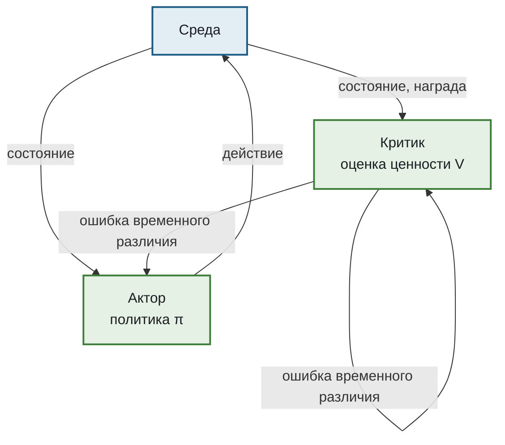

```mermaid
%%{init: {'theme':'base','themeVariables':{"fontFamily":"Inter, 'PT Sans', system-ui, sans-serif","fontSize":"15px","background":"#FFFFFF","primaryColor":"#E3EDF4","primaryTextColor":"#1A1D21","primaryBorderColor":"#1D5B85","secondaryColor":"#F6EBDC","secondaryTextColor":"#1A1D21","secondaryBorderColor":"#8A5214","tertiaryColor":"#E6F1E5","tertiaryTextColor":"#1A1D21","tertiaryBorderColor":"#3E7D3A","lineColor":"#414A54","textColor":"#1A1D21","mainBkg":"#E3EDF4","nodeBorder":"#1D5B85","nodeTextColor":"#1A1D21","clusterBkg":"#FFFFFF","clusterBorder":"#D3D9DF","edgeLabelBackground":"#FFFFFF","titleColor":"#1A1D21"}}}%%
flowchart LR
    D[(Сырые данные)] --> P[Предобработка]
    P --> S{Разделение}
    S -->|80 %| TR[Обучающая выборка]
    S -->|20 %| TE[Тестовая выборка]
    TR --> M[Обучение модели]
    M --> EV[Оценка на тесте]
    TE --> EV
    EV --> R[/Отчёт о качестве/]

    classDef data fill:#E3EDF4,stroke:#1D5B85,stroke-width:2px,color:#1A1D21;
    classDef proc fill:#F6EBDC,stroke:#8A5214,stroke-width:2px,color:#1A1D21;
    classDef out  fill:#F7E2E8,stroke:#7A0A2C,stroke-width:2px,color:#1A1D21;

    class D,TR,TE data;
    class P,S,M proc;
    class EV,R out;
```

```mermaid
%%{init: {'theme':'base','themeVariables':{"fontFamily":"Inter, 'PT Sans', system-ui, sans-serif","fontSize":"15px","background":"#FFFFFF","primaryColor":"#E3EDF4","primaryTextColor":"#1A1D21","primaryBorderColor":"#1D5B85","secondaryColor":"#F6EBDC","secondaryTextColor":"#1A1D21","secondaryBorderColor":"#8A5214","tertiaryColor":"#E6F1E5","tertiaryTextColor":"#1A1D21","tertiaryBorderColor":"#3E7D3A","lineColor":"#414A54","textColor":"#1A1D21","mainBkg":"#E3EDF4","nodeBorder":"#1D5B85","nodeTextColor":"#1A1D21","clusterBkg":"#FFFFFF","clusterBorder":"#D3D9DF","edgeLabelBackground":"#FFFFFF","titleColor":"#1A1D21"}}}%%
flowchart LR
    IN[Вход<br/>784] --> H1[Полносвязный<br/>256, ReLU]
    H1 --> DR[Dropout<br/>p = 0,3]
    DR --> H2[Полносвязный<br/>64, ReLU]
    H2 --> OUT[Выход<br/>10, softmax]
    OUT --> L[/Функция потерь<br/>перекрёстная энтропия/]

    classDef io    fill:#E3EDF4,stroke:#1D5B85,stroke-width:2px,color:#1A1D21;
    classDef layer fill:#F6EBDC,stroke:#8A5214,stroke-width:2px,color:#1A1D21;
    classDef loss  fill:#F7E2E8,stroke:#7A0A2C,stroke-width:2px,color:#1A1D21;

    class IN,OUT io;
    class H1,H2,DR layer;
    class L loss;
```

# Архитектуры моделей и конвейеры

Шаблоны для схем моделей машинного обучения и конвейеров обработки данных.

## Конвейер обучения

````markdown

````

## Архитектура сети по слоям

````markdown

````

## Актор — критик

````markdown

````

## Что здесь важно

**Форма узла указывает на его природу.** `[(...)]` — хранилище данных, `[...]` — обработка, `[/.../]` — результат, `{...}` — ветвление. Это стандартные обозначения блок-схем, и читатель распознаёт их без легенды.

**Размерности пишутся в узле.** Схема сети без указания размерностей не отвечает на главный вопрос, который к ней возникает.

**Цвет группирует по роли, а не по слою.** Все обучаемые блоки одного цвета, все данные — другого. Раскраска каждого слоя в свой цвет нарушила бы `ENF-DIAG-011` и ничего бы не сообщила.
