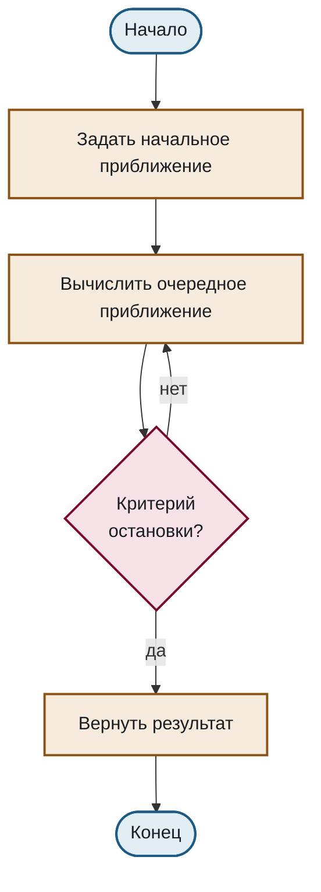

# Блок-схема алгоритма

Шаблон для описания последовательности шагов с ветвлениями и циклом. Скопируйте блок целиком, включая первую строку с директивой — без неё диаграмма отрисуется чужими цветами.

Ветви условия обязаны быть подписаны (`ENF-DIAG-043`): без подписей читателю приходится угадывать, какая ветвь означает «да».

````markdown

````

## Что здесь важно

**Направление `TD`** — сверху вниз, как читается алгоритм. Направления `BT` и `RL` противоречат привычке чтения (`ENF-DIAG-042`).

**Форма узла несёт смысл.** Скруглённый `([...])` — начало и конец, прямоугольник `[...]` — действие, ромб `{...}` — условие. Форма дублирует цвет и делает схему понятной в чёрно-белой печати (`ENF-DIAG-032`).

**Перенос строки внутри узла** — `<br/>`. Длинная подпись в один ряд растягивает всю схему по горизонтали.

**Не более пятнадцати узлов** (`ENF-DIAG-044`). Схема крупнее не помещается в полосу PDF читаемым кеглем; делите на обзорную схему и детализацию блоков.
