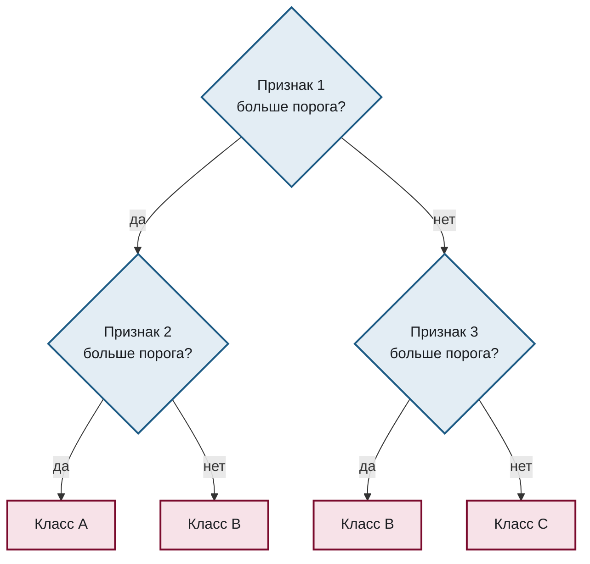
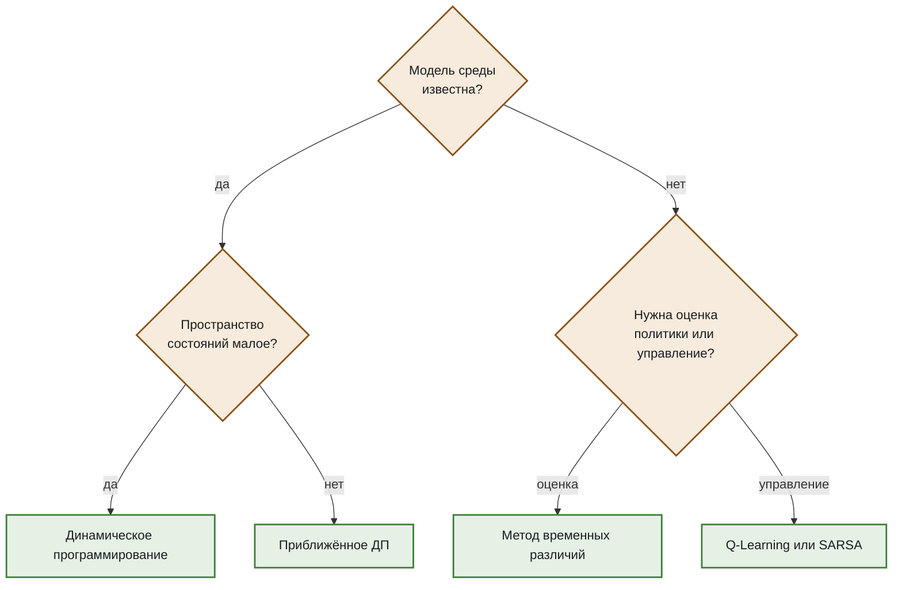

# Дерево решений

Шаблон для классификации по последовательности признаков и для схем выбора метода.

````markdown

````

## Вариант: выбор метода

Тот же шаблон удобен для схем «какой метод применять».

````markdown

````

## Что здесь важно

**Условие формулируется как вопрос с однозначным ответом.** «Признак 1 больше порога?» допускает «да» и «нет»; «Проверка признака 1» не допускает ничего.

**Листья визуально отличаются от узлов ветвления** — и формой, и цветом. Читатель должен видеть, где дерево заканчивается, не разбирая связи.

**Подписи ветвей не ограничены парой «да/нет»**: во втором примере это «оценка» и «управление». Главное, чтобы подпись была.
