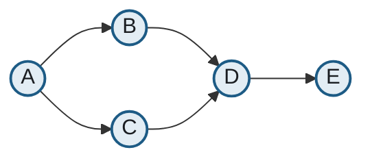
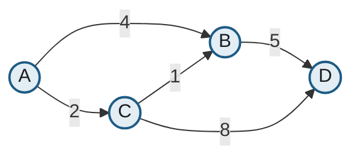
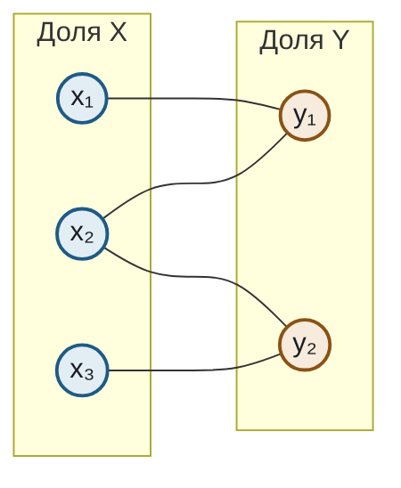

# Графы

Шаблоны для ориентированных, взвешенных и двудольных графов.

## Ориентированный граф

````markdown

````

## Взвешенный граф

Вес пишется подписью ребра — отдельного механизма для весов в Mermaid нет.

````markdown

````

## Двудольный граф

Разделение на доли делается подграфами; принадлежность доле дублируется цветом.

````markdown

````

## Неориентированное ребро

`---` вместо `-->`. В двудольном графе выше использовано именно оно: стрелка подразумевала бы направление, которого в задаче о паросочетании нет.

## Что здесь важно

**Круглые узлы `((...))` для вершин графа** — они отличают граф от блок-схемы, где узлы прямоугольные. Читатель распознаёт тип диаграммы до того, как прочтёт подписи.

**Направление `LR` для графов** — вертикальная раскладка графа в узкой полосе PDF даёт длинные пересекающиеся рёбра.

**Mermaid раскладывает узлы сам.** Если расположение вершин существенно — например, показывается планарность или геометрическая структура — используйте SVG, а не Mermaid.
