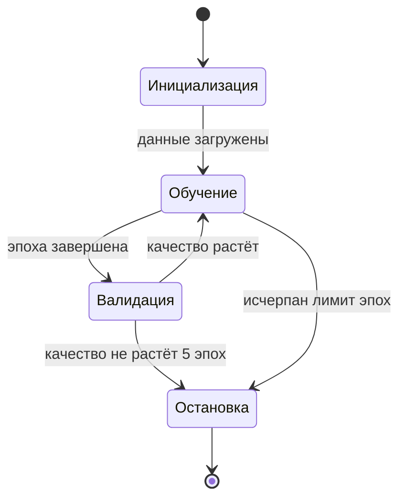
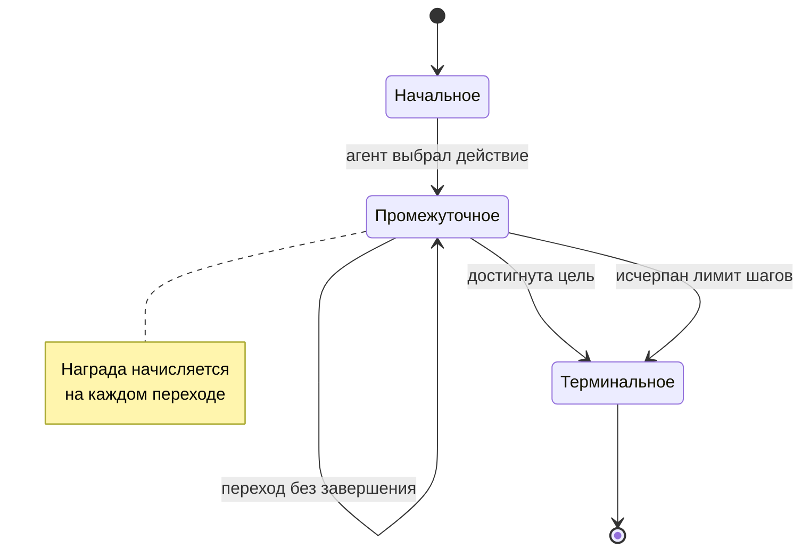

# Жизненный цикл: состояния и переходы

Шаблон на `stateDiagram-v2` — единственном типе диаграмм состояний, поддержанном и Obsidian, и Pandoc.

## Состояния процесса

````markdown

````

## Эпизод в обучении с подкреплением

````markdown

````

## Что здесь важно

**`[*]` обозначает начало и конец** — это встроенный синтаксис, отдельных узлов создавать не нужно.

**Каждый переход подписан условием.** Диаграмма состояний без подписей на переходах не сообщает главного: что именно вызывает смену состояния.

**Петля на состоянии** (`Промежуточное --> Промежуточное`) показывает, что процесс может оставаться в состоянии произвольно долго. Это важное свойство, и пропускать его не следует.

**Заметки через `note`** — для пояснений, которые не привязаны к конкретному переходу. Не злоупотребляйте: больше двух заметок на диаграмму означает, что пояснение стоит вынести в текст.

## Ограничение

Вложенные состояния (`state X { ... }`) в Mermaid поддерживаются, но по-разному рендерятся в разных версиях. Во фреймворке они не используются: сложную иерархию состояний надёжнее показать двумя диаграммами — обзорной и детальной.
