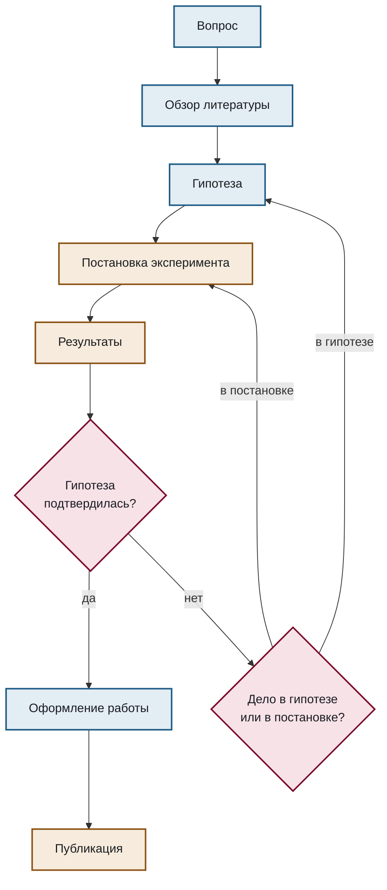
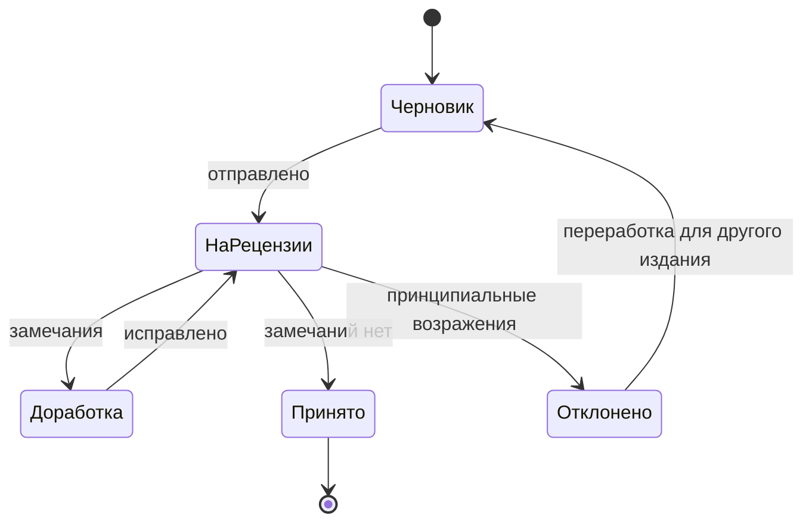

```mermaid
%%{init: {'theme':'base','themeVariables':{"fontFamily":"Inter, 'PT Sans', system-ui, sans-serif","fontSize":"15px","background":"#FFFFFF","primaryColor":"#E3EDF4","primaryTextColor":"#1A1D21","primaryBorderColor":"#1D5B85","secondaryColor":"#F6EBDC","secondaryTextColor":"#1A1D21","secondaryBorderColor":"#8A5214","tertiaryColor":"#E6F1E5","tertiaryTextColor":"#1A1D21","tertiaryBorderColor":"#3E7D3A","lineColor":"#414A54","textColor":"#1A1D21","mainBkg":"#E3EDF4","nodeBorder":"#1D5B85","nodeTextColor":"#1A1D21","clusterBkg":"#FFFFFF","clusterBorder":"#D3D9DF","edgeLabelBackground":"#FFFFFF","titleColor":"#1A1D21"}}}%%
flowchart LR
    T[Шаблон] --> W[Написание]
    W --> C1[Машинные проверки]
    C1 -->|нарушения| W
    C1 -->|чисто| C2[Ревью по чек-листу]
    C2 -->|замечания| W
    C2 -->|принято| B[Сборка в пять форматов]
    B --> PUBL[Готовый материал]

    classDef step  fill:#F6EBDC,stroke:#8A5214,stroke-width:2px,color:#1A1D21;
    classDef gate  fill:#F7E2E8,stroke:#7A0A2C,stroke-width:2px,color:#1A1D21;
    classDef final fill:#E6F1E5,stroke:#3E7D3A,stroke-width:2px,color:#1A1D21;

    class T,W,B step;
    class C1,C2 gate;
    class PUBL final;
```

# Исследовательский процесс

Шаблоны для схем научной работы: от гипотезы до публикации и цикл рецензирования.

## Путь исследования

````markdown

````

Обратите внимание на узел `REV`. Отрицательный результат чаще всего означает не «гипотеза неверна», а «эксперимент проверял не то»; схема, ведущая от неподтверждённой гипотезы сразу к новой гипотезе, описывает не исследование, а его имитацию.

## Цикл рецензирования

````markdown

````

## Ведение материала во фреймворке

````markdown

````

## Что здесь важно

**Циклы показываются явно.** Исследование и написание текста — итеративные процессы; линейная схема от вопроса к публикации была бы неправдой.

**Развилки различают причины.** «Не подтвердилось» — это не одно состояние, а два разных, и они ведут в разные места схемы.
