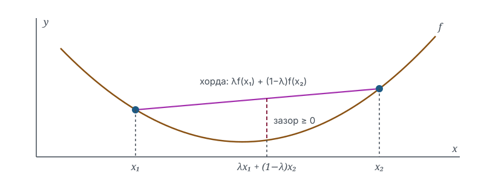

# Введение в выпуклую оптимизацию: выпуклые функции

## Зачем это нужно

Почти любая задача машинного обучения сводится к поиску минимума: подобрать параметры модели так, чтобы функция потерь стала как можно меньше. Но у произвольной функции может быть много «ям» — локальных минимумов. Алгоритм, спустившись в одну из них, останавливается и не узнаёт, что по соседству есть яма глубже.

Выпуклость (convexity) — то самое свойство, которое убирает эту проблему целиком. У выпуклой функции любой локальный минимум автоматически глобален: куда бы ни спустился алгоритм, он спустился туда, куда нужно. Поэтому линейная регрессия и логистическая регрессия решаются надёжно, а обучение глубокой сети — уже искусство: их функции потерь выпуклостью не обладают.

Эта лекция вводит два понятия — выпуклое множество и выпуклая функция — и показывает, как проверять выпуклость на практике.

## Обозначения

| Символ | Значение | Роль |
|--------|----------|------|
| $\enfVar{x_1}$, $\enfVar{x_2}$ | точки области определения | `variable` |
| $\enfPar{\lambda}$ | коэффициент выпуклой комбинации, $\enfPar{\lambda} \in [0, 1]$ | `parameter` |
| $\enfFun{f}$ | исследуемая функция | `function` |
| $\enfOp{f''}$ | вторая производная как критерий проверки | `operator` |
| $\enfTgt{x^*}$ | точка минимума | `target` |

## Выпуклая комбинация и выпуклое множество

### Постановка

Возьмём две точки $\enfVar{x_1}$ и $\enfVar{x_2}$. Всякая точка отрезка между ними записывается как

$$
\enfPar{\lambda}\,\enfVar{x_1} + (1 - \enfPar{\lambda})\,\enfVar{x_2},
\qquad \enfPar{\lambda} \in [0, 1],
$$

и называется **выпуклой комбинацией** (convex combination) точек $\enfVar{x_1}$ и $\enfVar{x_2}$. При $\enfPar{\lambda} = 1$ получается сама точка $\enfVar{x_1}$, при $\enfPar{\lambda} = 0$ — точка $\enfVar{x_2}$, при промежуточных значениях — внутренние точки отрезка.

Множество называется **выпуклым** (convex set), если вместе с любыми двумя своими точками оно содержит и весь отрезок между ними. Отрезок, прямая, круг, полуплоскость выпуклы; кольцо и «полумесяц» — нет: концы отрезка лежат в множестве, а середина выпадает наружу.

### Пример

Пусть $\enfVar{x_1} = 2$, $\enfVar{x_2} = 10$ и $\enfPar{\lambda} = 0{,}25$. Тогда выпуклая комбинация равна

$$
0{,}25 \cdot 2 + 0{,}75 \cdot 10 = 0{,}5 + 7{,}5 = 8.
$$

Точка $8$ лежит внутри отрезка $[2, 10]$, причём ближе к $\enfVar{x_2}$: коэффициент при $\enfVar{x_2}$ втрое больше. Коэффициенты работают как веса — чем больше вес точки, тем ближе к ней результат.

## Определение выпуклой функции

### Постановка

Функция $\enfFun{f}$, заданная на выпуклом множестве, называется **выпуклой** (convex function), если для любых точек $\enfVar{x_1}$, $\enfVar{x_2}$ из области определения и любого $\enfPar{\lambda} \in [0, 1]$ выполняется

$$
\enfFun{f}\bigl(\enfPar{\lambda}\,\enfVar{x_1} + (1 - \enfPar{\lambda})\,\enfVar{x_2}\bigr)
\;\le\;
\enfPar{\lambda}\,\enfFun{f}(\enfVar{x_1}) + (1 - \enfPar{\lambda})\,\enfFun{f}(\enfVar{x_2}).
$$

Слева — значение функции в точке отрезка. Справа — та же выпуклая комбинация, но применённая к значениям функции; геометрически это точка хорды, соединяющей две точки графика. Неравенство читается одной фразой: **хорда нигде не опускается ниже графика**.

Если при $\enfVar{x_1} \neq \enfVar{x_2}$ и $\enfPar{\lambda} \in (0, 1)$ неравенство строгое, функция называется **строго выпуклой** (strictly convex): хорда касается графика только концами. Если неравенство выполняется в другую сторону, функция **вогнутая** (concave); вогнутость $\enfFun{f}$ равносильна выпуклости $-\enfFun{f}$.

### Пример

Проверим определение для $\enfFun{f}(\enfVar{x}) = \enfVar{x}^2$ на точках $\enfVar{x_1} = 1$, $\enfVar{x_2} = 5$ при $\enfPar{\lambda} = 0{,}5$.

Левая часть: точка отрезка $0{,}5 \cdot 1 + 0{,}5 \cdot 5 = 3$, значение функции

$$
\enfFun{f}(3) = 3^2 = 9.
$$

Правая часть: комбинация значений

$$
0{,}5 \cdot \enfFun{f}(1) + 0{,}5 \cdot \enfFun{f}(5) = 0{,}5 \cdot 1 + 0{,}5 \cdot 25 = 13.
$$

Действительно, $9 \le 13$ — в средней точке график прошёл на $4$ ниже хорды.

Одна проверка в одной точке определение не доказывает — оно требует «для любых». Докажем для $\enfFun{f}(\enfVar{x}) = \enfVar{x}^2$ целиком.

> [!proof] Выпуклость квадратичной функции
> Вычтем левую часть определения из правой. По свойству квадрата суммы
> $$
> \enfPar{\lambda}\,\enfVar{x_1}^2 + (1 - \enfPar{\lambda})\,\enfVar{x_2}^2
> - \bigl(\enfPar{\lambda}\,\enfVar{x_1} + (1 - \enfPar{\lambda})\,\enfVar{x_2}\bigr)^2
> = \enfPar{\lambda}(1 - \enfPar{\lambda})\bigl(\enfVar{x_1} - \enfVar{x_2}\bigr)^2.
> $$
> Каждый множитель справа неотрицателен: $\enfPar{\lambda} \ge 0$, $1 - \enfPar{\lambda} \ge 0$, квадрат разности $\ge 0$ по определению квадрата. Значит, разность правой и левой частей неотрицательна, и неравенство выпуклости выполнено для любых точек и любого $\enfPar{\lambda}$. $\blacksquare$

## Критерий через вторую производную

### Постановка

Проверять определение напрямую неудобно: в нём два произвольных аргумента и параметр. Для дважды дифференцируемых функций одной переменной есть критерий проще: функция выпукла на промежутке тогда и только тогда, когда на нём

$$
\enfOp{f''}(\enfVar{x}) \ge 0.
$$

Интуиция: $\enfOp{f''}$ — скорость изменения наклона. Неотрицательная вторая производная означает, что наклон не убывает: график «загибается вверх», как чаша, и хорда оказывается над ним.

### Примеры

Три проверки по критерию.

Для $\enfFun{f}(\enfVar{x}) = \enfVar{x}^2$: последовательно дифференцируя, $\enfOp{f''}(\enfVar{x}) = 2 > 0$ всюду — функция строго выпукла на всей прямой, что согласуется с доказательством выше.

Для $\enfFun{f}(\enfVar{x}) = e^{\enfVar{x}}$: производная любого порядка равна $e^{\enfVar{x}} > 0$ — строго выпукла на всей прямой.

Для $\enfFun{f}(\enfVar{x}) = \ln \enfVar{x}$ при $\enfVar{x} > 0$: дифференцируя дважды, $\enfOp{f''}(\enfVar{x}) = -1/\enfVar{x}^2 < 0$ — логарифм вогнут, а выпукл его минус: $-\ln \enfVar{x}$. Именно поэтому в машинном обучении минимизируют отрицательный логарифм правдоподобия: задача становится выпуклой.

## Почему выпуклость решает задачу оптимизации

### Постановка

Точка $\enfTgt{x^*}$ — **локальный минимум**, если значения функции в некоторой её окрестности не меньше $\enfFun{f}(\enfTgt{x^*})$, и **глобальный минимум**, если это верно на всей области определения. Ключевое свойство выпуклых функций: всякий локальный минимум является глобальным.

### Вывод

Рассуждение от противного. Пусть $\enfTgt{x^*}$ — локальный минимум, но где-то существует точка $\enfVar{x_2}$ со значением $\enfFun{f}(\enfVar{x_2}) < \enfFun{f}(\enfTgt{x^*})$. Двигаясь из $\enfTgt{x^*}$ к $\enfVar{x_2}$ по точкам выпуклой комбинации, по определению выпуклости получаем при любом $\enfPar{\lambda}$, близком к $1$:

$$
\enfFun{f}\bigl(\enfPar{\lambda}\,x^* + (1 - \enfPar{\lambda})\,\enfVar{x_2}\bigr)
\le \enfPar{\lambda}\,\enfFun{f}(x^*) + (1 - \enfPar{\lambda})\,\enfFun{f}(\enfVar{x_2})
< \enfFun{f}(x^*),
$$

где последнее строгое неравенство выполнено потому, что в комбинацию с положительным весом входит значение, меньшее $\enfFun{f}(x^*)$. Но точки с $\enfPar{\lambda}$, близким к $1$, лежат сколь угодно близко к $x^*$ — получили точки лучше минимума в любой его окрестности, что противоречит локальности минимума. Значит, точки $\enfVar{x_2}$ с меньшим значением не существует, и минимум глобален.

Для алгоритмов это означает: градиентному спуску на выпуклой функции достаточно найти хоть какой-нибудь минимум — он гарантированно окажется искомым.

## Что стоит запомнить

1. Выпуклая комбинация $\enfPar{\lambda}\,\enfVar{x_1} + (1 - \enfPar{\lambda})\,\enfVar{x_2}$ — это точка отрезка, а коэффициенты — веса близости к концам.
2. Функция выпукла, когда хорда между любыми двумя точками графика не опускается ниже самого графика.
3. Практический критерий для функций одной переменной: $\enfOp{f''}(\enfVar{x}) \ge 0$ на всём промежутке.
4. У выпуклой функции всякий локальный минимум глобален — поэтому выпуклые задачи оптимизации решаются надёжно.
5. Вогнутость — это выпуклость с обратным знаком: максимизация вогнутой функции равносильна минимизации выпуклой.

## Проверка себя

1. Запишите выпуклую комбинацию точек $3$ и $11$ с коэффициентом $\enfPar{\lambda} = 0{,}75$ и вычислите её.
2. Является ли объединение двух непересекающихся отрезков выпуклым множеством? Обоснуйте через определение.
3. Проверьте по критерию второй производной, выпукла ли функция $\enfFun{f}(\enfVar{x}) = \enfVar{x}^4$ и является ли её выпуклость строгой в нуле.
4. Функция $\enfFun{f}(\enfVar{x}) = |\enfVar{x}|$ не дифференцируема в нуле, поэтому критерий второй производной к ней неприменим. Докажите её выпуклость прямо из определения, использовав неравенство треугольника.
5. Функция потерь строится как сумма квадратов ошибок линейной модели. Опираясь на материал лекции, объясните, почему у такой задачи не бывает «ложных» локальных минимумов, в которых мог бы застрять градиентный спуск.

## Что дальше

- [Производная как скорость изменения](../Calculus/Limit_of_a_Function.learning.md) — предел, на котором строится критерий второй производной
- [Линейная регрессия](../../../examples/Linear_Regression.learning.md) — выпуклая задача обучения, решаемая точно
