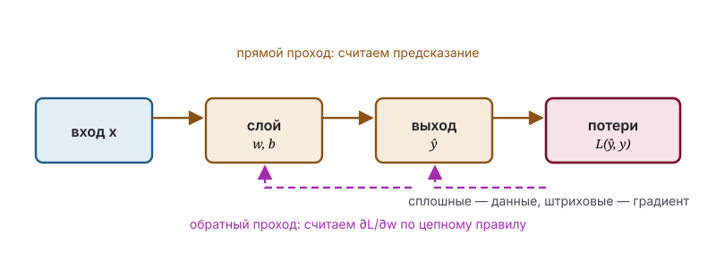

# Обратное распространение ошибки

Для линейной модели главы 6 минимум функции потерь найден в замкнутом виде. Для многослойной сети такого решения нет, и оптимизация ведётся градиентными методами. Настоящий раздел посвящён эффективному вычислению градиента — задаче, определившей практическую применимость глубоких моделей.

## Обозначения

| Символ | Значение | Роль | Введён |
|--------|----------|------|--------|
| $z_k$, $h_k$ | линейная комбинация и выход $k$-го слоя | `variable` | здесь |
| $\sigma$ | функция активации | `function` | гл. 8.1 |
| $w_k$, $b_k$ | параметры $k$-го слоя | `parameter` | гл. 8.1 |
| $\delta_k$ | ошибка слоя, $\partial \mathcal{L}/\partial z_k$ | — | здесь |
| $\mathcal{L}$ | функция потерь | — | гл. 6.2 |

## 8.2. Постановка

Сеть из $L$ слоёв задаётся рекуррентно:

$$
\enfVar{z_k} = \enfPar{w_k}\,\enfVar{h_{k-1}} + \enfPar{b_k}, \qquad \enfVar{h_k} = \enfFun{\sigma}(\enfVar{z_k}), \qquad \enfVar{h_0} = \enfVar{x}.
$$

Функция потерь — гладкая функция выхода последнего слоя. Требуется вычислить $\partial \mathcal{L}/\partial \enfPar{w_k}$ и $\partial \mathcal{L}/\partial \enfPar{b_k}$ для всех $k$.

Прямое применение цепного правила к каждому параметру независимо приводит к затратам, квадратичным по глубине сети: общие для слоя множители пересчитываются для каждого веса заново. Устранение этой избыточности и составляет содержание алгоритма.

## 8.3. Рекуррентное соотношение

> [!definition] Определение 8.1. Ошибка слоя
> Ошибкой $k$-го слоя называется частная производная $\delta_k = \partial \mathcal{L} / \partial \enfVar{z_k}$.

> [!theorem] Теорема 8.2. Обратное распространение
> Ошибки слоёв удовлетворяют соотношениям
> $$\delta_L = \frac{\partial \mathcal{L}}{\partial \enfVar{z_L}}, \qquad \delta_k = \delta_{k+1}\,\enfPar{w_{k+1}}\,\enfFun{\sigma'}(\enfVar{z_k}) \quad (k < L),$$
> а производные по параметрам выражаются через них как
> $$\frac{\partial \mathcal{L}}{\partial \enfPar{w_k}} = \delta_k\,\enfVar{h_{k-1}}, \qquad \frac{\partial \mathcal{L}}{\partial \enfPar{b_k}} = \delta_k.$$

> [!proof] Доказательство
> Величина $\enfVar{z_k}$ влияет на функцию потерь исключительно через $\enfVar{h_k}$, а та — исключительно через $\enfVar{z_{k+1}}$; иных путей влияния в схеме нет. По цепному правилу
> $$\delta_k = \frac{\partial \mathcal{L}}{\partial \enfVar{z_{k+1}}}\cdot\frac{\partial \enfVar{z_{k+1}}}{\partial \enfVar{h_k}}\cdot\frac{\partial \enfVar{h_k}}{\partial \enfVar{z_k}}.$$
> Первый множитель равен $\delta_{k+1}$ по определению 8.1, второй равен $\enfPar{w_{k+1}}$ в силу линейности, третий равен $\enfFun{\sigma'}(\enfVar{z_k})$. Формулы для производных по параметрам получаются применением цепного правила к $\enfVar{z_k} = \enfPar{w_k}\enfVar{h_{k-1}} + \enfPar{b_k}$, откуда $\partial \enfVar{z_k}/\partial \enfPar{w_k} = \enfVar{h_{k-1}}$ и $\partial \enfVar{z_k}/\partial \enfPar{b_k} = 1$. $\blacksquare$

> [!intuition] Смысл результата
> Производная по весу есть произведение проходящего через него сигнала и чувствительности выхода слоя к потерям. Обе величины необходимы: сигнал, ни на что не влияющий, градиента не создаёт, равно как и влияние при отсутствии сигнала.

## 8.4. Алгоритм и его стоимость

Вычисление состоит из прямого прохода с сохранением всех $\enfVar{z_k}$ и $\enfVar{h_k}$, вычисления $\delta_L$ и обратного прохода по теореме 8.2. Все производные получаются за один обход сети; вычислительная стоимость обратного прохода сравнима со стоимостью прямого, тогда как расход памяти пропорционален суммарному размеру сохраняемых промежуточных величин.

> [!example] Пример 8.3
> Двухслойная сеть с активацией ReLU, параметрами $\enfPar{w_1} = 2$, $\enfPar{b_1} = 0$, $\enfPar{w_2} = 3$, $\enfPar{b_2} = 1$, входом $\enfVar{x} = 1$ и целью 5 даёт $\enfVar{z_1} = 2$, $\enfVar{h_1} = 2$, $\enfVar{z_2} = 7$. Отсюда $\delta_2 = 2$, $\delta_1 = 6$, $\partial \mathcal{L}/\partial \enfPar{w_2} = 4$ и $\partial \mathcal{L}/\partial \enfPar{w_1} = 6$. Численная проверка возмущением $\enfPar{w_1}$ на $10^{-3}$ даёт то же значение 6.

> [!remark] Замечание 8.4. Проверка градиента
> Численное дифференцирование непригодно для обучения по стоимости, но остаётся основным средством отладки реализации: расхождение с аналитическим градиентом однозначно указывает на ошибку в обратном проходе.

## Итоги раздела

Обратное распространение есть цепное правило, организованное так, чтобы общие для слоя множители вычислялись однократно. Центральное понятие — ошибка слоя, чувствительность потерь к его входу; она распространяется от выхода сети к входу по рекуррентному соотношению теоремы 8.2, после чего производные по параметрам получаются одним умножением. Итоговая стоимость линейна по числу параметров, что и делает обучение глубоких моделей практически осуществимым. Обратная сторона метода — необходимость хранить промежуточные величины прямого прохода и мультипликативное накопление множителей $\sigma'$, приводящее к затуханию или взрыву градиента в глубоких сетях.

## Упражнения

**8.1.** Обобщите теорему 8.2 на векторный случай, записав соотношения в матричной форме, и укажите, где транспонирование становится существенным.

**8.2.** Пусть производная активации всюду равна $c$. Выразите $\delta_1$ через $\delta_L$ для сети из $L$ слоёв и укажите условия затухания и взрыва градиента.

**8.3.** Покажите, что при инициализации всех весов слоя одинаковыми значениями градиенты этих весов совпадают на каждом шаге, вследствие чего нейроны слоя остаются неразличимыми.

**8.4.** Оцените расход памяти на хранение промежуточных величин для сети из $L$ слоёв ширины $n$ при размере пакета $m$.

**8.5.** Выведите $\delta_L$ для перекрёстной энтропии в сочетании с softmax и объясните, почему полученное выражение оказывается проще, чем для каждой из этих функций по отдельности.

## Библиографические замечания

Метод в применении к многослойным сетям стал широко известен после работы Румельхарта, Хинтона и Уильямса 1986 года; сама идея обратного дифференцирования композиции функций старше и известна в численном анализе как обратный режим автоматического дифференцирования.
