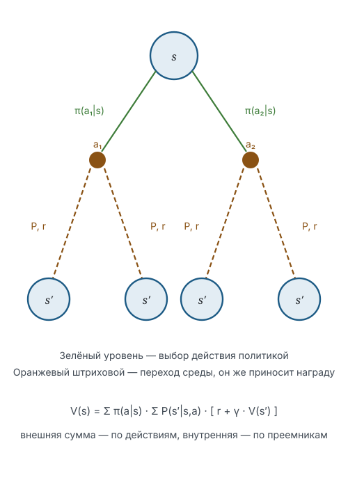

# Уравнение Беллмана для функции ценности состояния

В предыдущем разделе марковский процесс принятия решений был задан четвёркой из пространства состояний, пространства действий, вероятностей перехода и функции награды. Здесь мы получаем основное соотношение, связывающее ценности состояний между собой, и устанавливаем существование и единственность его решения.

## Обозначения

| Символ | Значение | Роль |
|--------|----------|------|
| $s, s' \in \mathcal{S}$ | состояние и состояние-преемник | `variable` |
| $a \in \mathcal{A}$ | действие | `function` |
| $\pi(a \mid s)$ | политика | `parameter` |
| $\gamma \in [0,1)$ | коэффициент дисконтирования | `parameter` |
| $V^\pi$ | функция ценности состояния | — |
| $\mathcal{T}^\pi$ | оператор Беллмана для политики $\pi$ | — |

Награда $r$, отдача $G_t$ и вероятность перехода $P$ введены в разделе 4.1.

## Определение и основное соотношение

> [!definition] Определение 4.4. Функция ценности состояния
> Функцией ценности состояния при политике $\enfPar{\pi}$ называется отображение
> $$V^\pi(\enfVar{s}) = \mathbb{E}_\pi\!\left[G_t \mid S_t = \enfVar{s}\right],$$
> где ожидание берётся по траекториям, порождаемым политикой $\enfPar{\pi}$ и динамикой среды.

> [!theorem] Теорема 4.5. Уравнение Беллмана
> Для любой политики $\enfPar{\pi}$ и любого состояния $\enfVar{s}$ выполняется
> $$V^\pi(\enfVar{s}) = \sum_{\enfFun{a}} \enfPar{\pi}(\enfFun{a} \mid \enfVar{s}) \sum_{\enfVar{s'}} P(\enfVar{s'} \mid \enfVar{s}, \enfFun{a})\left[r + \gamma V^\pi(\enfVar{s'})\right].$$

> [!proof] Доказательство
> Отдача удовлетворяет рекуррентному соотношению $G_t = r_{t+1} + \gamma G_{t+1}$, получаемому вынесением $\gamma$ за скобку в определении. Подставим его в определение ценности и воспользуемся линейностью математического ожидания:
> $$V^\pi(\enfVar{s}) = \mathbb{E}_\pi\!\left[r_{t+1} \mid S_t = \enfVar{s}\right] + \gamma\,\mathbb{E}_\pi\!\left[G_{t+1} \mid S_t = \enfVar{s}\right].$$
> Раскроем оба ожидания по двум источникам случайности — выбору действия политикой и переходу среды, — которые при фиксированном состоянии независимы, откуда произведение вероятностей. По марковскому свойству условное распределение $G_{t+1}$ при известном $S_{t+1} = \enfVar{s'}$ не зависит от предыстории, поэтому $\mathbb{E}_\pi[G_{t+1} \mid S_{t+1} = \enfVar{s'}] = V^\pi(\enfVar{s'})$. Подстановка даёт требуемое. $\blacksquare$

> [!intuition] Смысл соотношения
> Ценность состояния складывается из немедленной награды и дисконтированной ценности того, куда агент попадёт дальше. Бесконечная сумма при этом не вычисляется: она заменена конечной системой из $|\mathcal{S}|$ уравнений.

## Оператор Беллмана и корректность задачи

> [!definition] Определение 4.6. Оператор Беллмана
> Оператор $\mathcal{T}^\pi \colon \mathbb{R}^{|\mathcal{S}|} \to \mathbb{R}^{|\mathcal{S}|}$ задаётся правой частью уравнения теоремы 4.5, в которую вместо $V^\pi$ подставлен произвольный вектор.

> [!theorem] Теорема 4.7. Сжимаемость
> При $\gamma < 1$ оператор $\mathcal{T}^\pi$ является сжатием в равномерной норме с коэффициентом $\gamma$:
> $$\|\mathcal{T}^\pi U - \mathcal{T}^\pi W\|_\infty \leq \gamma\,\|U - W\|_\infty.$$

> [!proof] Доказательство
> Разность значений оператора в точке $\enfVar{s}$ равна $\gamma$, умноженному на усреднение разности $U - W$ по распределению перехода. Усреднение по вероятностной мере не превосходит максимума модуля усредняемой величины, то есть $\|U - W\|_\infty$. Взятие максимума по $\enfVar{s}$ даёт требуемую оценку. $\blacksquare$

> [!corollary] Следствие 4.8
> Уравнение Беллмана имеет единственное решение, и последовательность $V_{k+1} = \mathcal{T}^\pi V_k$ сходится к нему из любого начального приближения с оценкой $\|V_k - V^\pi\|_\infty \leq \gamma^k\|V_0 - V^\pi\|_\infty$.

> [!proof] Доказательство
> Пространство $\mathbb{R}^{|\mathcal{S}|}$ с равномерной нормой полно, поэтому по принципу сжимающих отображений сжатие имеет единственную неподвижную точку и итерации к ней сходятся. Оценка скорости получается $k$-кратным применением неравенства теоремы 4.7. Неподвижная точка $\mathcal{T}^\pi$ совпадает с решением уравнения Беллмана по определению оператора. $\blacksquare$

## Пример 4.9

Среда из двух состояний $\enfVar{A}$ и $\enfVar{B}$ с единственным действием, $\gamma = 0{,}9$; переход из $\enfVar{A}$ в $\enfVar{B}$ приносит награду 2, обратный переход — награду 0. Система принимает вид

$$
\begin{aligned}
V(\enfVar{A}) &= 2 + 0{,}9\,V(\enfVar{B}), \\
V(\enfVar{B}) &= 0{,}9\,V(\enfVar{A}),
\end{aligned}
$$

откуда $V(\enfVar{A}) = 2/(1 - 0{,}81) \approx 10{,}53$ и $V(\enfVar{B}) \approx 9{,}47$. Разность ценностей равна дисконтированной величине награды, получаемой на шаг раньше.

## Итоги раздела

Функция ценности состояния определена как ожидаемая дисконтированная отдача и удовлетворяет уравнению Беллмана — конечной системе линейных уравнений, заменяющей бесконечное суммирование. Ключевую роль играют два свойства: марковость, позволяющая замкнуть рекурсию, и строгое дисконтирование, обеспечивающее сжимаемость соответствующего оператора. Из сжимаемости следуют существование и единственность решения, а также геометрическая скорость сходимости итераций — факт, на котором строится вся вычислительная часть следующего раздела.

## Упражнения

**4.1.** Покажите, что при $\gamma = 1$ и наличии поглощающего состояния, достижимого за конечное число шагов с вероятностью единица, уравнение Беллмана сохраняет единственность решения, хотя оператор перестаёт быть сжатием.

**4.2.** Выведите уравнение Беллмана для функции ценности действия $Q^\pi(s, a)$ и укажите, в каком месте вывода используется марковское свойство.

**4.3.** Оцените, сколько итераций требуется для достижения точности $10^{-3}$ при $\gamma = 0{,}95$ и начальной ошибке, равной 10.

**4.4.** Постройте среду из трёх состояний, в которой ценность состояния с наибольшей немедленной наградой оказывается наименьшей.

**4.5.** Докажите, что оператор Беллмана монотонен: из $U \leq W$ покомпонентно следует $\mathcal{T}^\pi U \leq \mathcal{T}^\pi W$.

## Библиографические замечания

Изложение следует классической схеме динамического программирования; современная трактовка с той же системой обозначений содержится в книге Саттона и Барто, глава 3. Принцип сжимающих отображений в применении к уравнению Беллмана восходит к работам по динамическому программированию середины прошлого века.

1. Sutton R. S., Barto A. G. Reinforcement Learning: An Introduction. 2nd ed. MIT Press, 2018. Глава 3.
