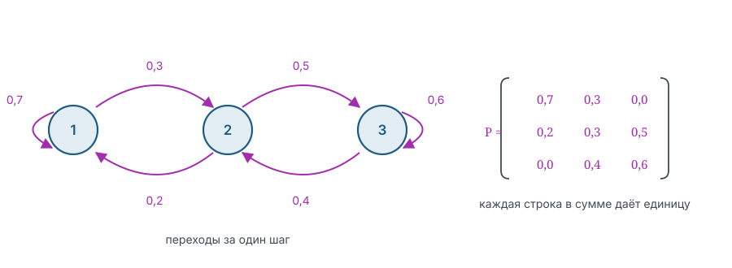

# Введение в случайные процессы

## Зачем это нужно

Случайная величина отвечает на вопрос «какое значение выпадет». Случайный процесс отвечает на вопрос потруднее: «как это значение будет меняться со временем». Шум на входе усилителя, число заявок в очереди, цена актива, координата пылинки в воде, состояние среды в задаче обучения с подкреплением — всё это не одно число, а целая функция времени, и каждый запуск эксперимента даёт свою функцию.

Отсюда сразу возникает трудность. Полное описание случайной величины — это одна функция распределения. Полное описание процесса — это распределения всех конечных наборов сечений сразу, то есть бесконечное семейство функций растущего числа аргументов. Пользоваться таким описанием напрямую нельзя, и вся практическая теория выросла из вопроса: чем его заменить, чтобы потери были приемлемы.

Ответ теории даётся в три хода, и на них держится весь этот материал. Первый ход: ограничиться моментами первых двух порядков — средним и корреляционной функцией. Второй: заметить, что у многих процессов характеристики не зависят от начала отсчёта времени, — это стационарность, и она сокращает корреляционную функцию двух аргументов до функции одного. Третий: перевести корреляционную функцию в частотную область преобразованием Фурье — получается спектральная плотность, а вместе с ней и весь инженерный аппарат расчёта прохождения шума через линейные цепи.

Отдельная ветка — марковские процессы, где вместо моментов работает другая экономия: будущее зависит только от настоящего, а не от всей предыстории. Из неё вырастают цепи Маркова, уравнения Колмогорова и диффузионные процессы, а вместе с ними — модели, на которых стоит обучение с подкреплением.

## Обозначения

| Символ | Значение | Роль |
|--------|----------|------|
| $\enfVar{X}(t)$, $\enfVar{Y}(t)$ | случайный процесс и его сечение в момент $t$ | `variable` |
| $\enfVar{W}(t)$ | винеровский процесс (броуновское движение) | `variable` |
| $\enfVar{N}(t)$ | пуассоновский процесс: число событий к моменту $t$ | `variable` |
| $\enfVar{\xi}(t)$ | белый шум | `variable` |
| $\enfVar{A}$, $\enfVar{\Phi}$ | случайные амплитуда и фаза гармоники | `variable` |
| $\enfVar{\Theta}$ | интервал между соседними событиями потока | `variable` |
| $\enfFun{F}$, $\enfFun{f}$ | функция распределения и плотность | `function` |
| $\enfFun{m}_X(t)$ | математическое ожидание процесса | `function` |
| $\enfFun{D}_X(t)$ | дисперсия процесса | `function` |
| $\enfFun{h}$, $\enfFun{H}$ | импульсный отклик и частотная характеристика фильтра | `function` |
| $\enfFun{a}$, $\enfFun{b}$ | коэффициенты сноса и диффузии | `function` |
| $\enfPar{\lambda}$ | интенсивность потока событий | `parameter` |
| $\enfPar{\alpha}$ | скорость затухания корреляции | `parameter` |
| $\enfPar{\sigma}$ | масштаб процесса | `parameter` |
| $\enfPar{N_0}$ | спектральная плотность белого шума | `parameter` |
| $\enfPar{\omega_0}$ | частота гармоники | `parameter` |
| $\enfOp{\mathbb{E}}$ | усреднение по ансамблю | `operator` |
| $\enfOp{\mathbb{P}}$ | вероятность | `operator` |
| $\enfOp{\mathbf{P}}$ | матрица переходных вероятностей | `operator` |
| $\enfOp{\mathbf{\Lambda}}$ | генератор: матрица интенсивностей переходов | `operator` |
| $\enfVar{\boldsymbol{p}}^{(n)}$ | распределение цепи по состояниям на шаге $n$ | `variable` |
| $\enfTgt{R}_X$, $\enfTgt{K}_X$, $\enfTgt{r}_X$ | корреляционная, ковариационная и нормированная функции | `target` |
| $\enfTgt{S}_X$ | спектральная плотность мощности | `target` |
| $\enfTgt{\boldsymbol{\pi}}$ | стационарное распределение цепи Маркова | `target` |
| $\enfTgt{\boldsymbol{\Sigma}}$ | ковариационная матрица сечений | `target` |

Роли распределены по смыслу, а не по буквам. Синий — сам процесс, то есть объект, над которым мы действуем. Коричневый — детерминированные функции, которые получаются из процесса усреднением или которые действуют на него (фильтр, снос, диффузия). Зелёный — параметры моделей: то, что задаётся при постановке задачи и остаётся постоянным. Пурпурный — операторы усреднения и перехода. Тёмно-красный — то, ради чего построен весь аппарат: корреляционная функция, спектр, стационарное распределение.

Не окрашивается ничего служебного (`ENF-MATH-020`): аргументы $t$, $s$, значения $x$, сдвиг $\tau$, круговая частота $\omega$, номера $n$, $m$, состояния цепи $i$, $j$, $k$, а также индекс процесса в записи $\enfTgt{R}_X$ — это метка, а не самостоятельная величина. Множества обозначены начертанием: $\mathbb{T}$ — область изменения времени, $\Omega$ — пространство элементарных исходов, $\mathbb{R}$ — числовая прямая, $\mathcal{N}$ — нормальный закон (`ENF-MATH-013`).

Символы отдельных разделов — пробная функция $\enfFun{g}$ в формуле Ито, вероятности перехода $\enfOp{p}_{ij}$, интенсивности $\enfPar{\lambda}_{ij}$ — вводятся там, где встречаются, и наследуют роль своего семейства.

> [!warning] Буква $\omega$ занята дважды
>
> В определении процесса $\omega$ — элементарный исход, номер реализации в ансамбле. В спектральном разделе $\omega$ — круговая частота. Так сложилось в литературе, и переобозначать здесь вреднее, чем предупредить: в каждом разделе значение указано явно, а спутать их негде — исход всегда стоит вторым аргументом процесса, частота всегда аргументом спектра.

## Что такое случайный процесс

> [!definition] Случайный процесс
>
> **Случайный процесс** (random process, stochastic process) — семейство случайных величин, заданных на одном вероятностном пространстве и занумерованных параметром «время»:
> $$
> \enfVar{X} = \bigl\{\enfVar{X}(t, \omega) : t \in \mathbb{T},\ \omega \in \Omega \bigr\}.
> $$
> У этой функции двух аргументов два способа прочтения. Зафиксируем $t$ — получится случайная величина, **сечение** процесса. Зафиксируем $\omega$ — получится обычная функция времени, **реализация** (траектория) процесса.

Различие между сечением и реализацией стоит проговорить, потому что вся дальнейшая теория играет именно на нём. Сечение живёт «поперёк» ансамбля: это разброс значений в один и тот же момент по всем возможным исходам эксперимента. Реализация живёт «вдоль» времени: это одна-единственная кривая, которую мы фактически наблюдаем в опыте.

> [!intuition] Ансамбль против одной записи
>
> Представьте сто одинаковых радиоприёмников, включённых одновременно. Осциллограмма шума на каждом своя — это сто реализаций одного процесса. Сечение в момент $t$ — сто чисел, снятых со всех приборов разом; их разброс и описывает сечение как случайную величину. Реализация — одна осциллограмма, записанная с одного приёмника за час.
>
> Теория строится по ансамблю, а измерять в реальном опыте почти всегда приходится по одной записи. Мост между этими двумя картинами называется эргодичностью, и ему посвящён отдельный раздел ниже.

Полное описание процесса задаётся всеми конечномерными распределениями:

$$
\enfFun{F}_{t_1, \dots, t_n}(x_1, \dots, x_n)
= \enfOp{\mathbb{P}}\bigl\{ \enfVar{X}(t_1) \leq x_1,\ \dots,\ \enfVar{X}(t_n) \leq x_n \bigr\}.
$$

Здесь $\enfFun{F}$ — совместная функция распределения $n$ сечений, взятых в моменты $t_1, \dots, t_n$; набор моментов и их количество $n$ произвольны. Семейство таких функций для всех $n$ и всех наборов моментов и есть исчерпывающее описание процесса.

Семейство не может быть произвольным: распределения разных размерностей обязаны согласовываться друг с другом. Если мы «забудем» про последнее сечение, то есть перестанем его ограничивать, должно получиться распределение меньшей размерности:

$$
\lim_{x_n \to +\infty} \enfFun{F}_{t_1, \dots, t_n}(x_1, \dots, x_n)
= \enfFun{F}_{t_1, \dots, t_{n-1}}(x_1, \dots, x_{n-1}).
$$

> [!theorem] Теорема Колмогорова о продолжении
>
> Если семейство конечномерных распределений согласовано (условие выше плюс симметрия относительно перестановки пар «момент — значение»), то существует вероятностное пространство и заданный на нём случайный процесс, у которого эти распределения и являются конечномерными.

Практическая ценность теоремы — разрешительная: она позволяет задавать процесс перечислением конечномерных распределений, не строя вероятностное пространство явно. Именно так ниже определяются пуассоновский и винеровский процессы.

## Моментные характеристики

Работать с бесконечным семейством распределений неудобно, поэтому от него переходят к числовым характеристикам. Первого порядка — среднее, второго — корреляционная функция. Для гауссовских процессов, как выяснится ниже, этой пары достаточно, чтобы восстановить всё описание целиком.

**Математическое ожидание** процесса — среднее по ансамблю в каждый момент времени. Это уже не случайная величина, а обычная функция:

$$
\enfFun{m}_X(t) = \enfOp{\mathbb{E}}\bigl[\enfVar{X}(t)\bigr]
= \int_{-\infty}^{+\infty} x\, \enfFun{f}(x; t)\, \mathrm{d}x,
$$

где $\enfFun{f}(x; t)$ — одномерная плотность сечения в момент $t$. Функция $\enfFun{m}_X$ описывает «регулярную» часть процесса — тренд, вокруг которого происходят колебания.

**Дисперсия** измеряет разброс сечения около среднего:

$$
\enfFun{D}_X(t) = \enfOp{\mathbb{E}}\Bigl[\bigl(\enfVar{X}(t) - \enfFun{m}_X(t)\bigr)^2\Bigr]
= \enfOp{\mathbb{E}}\bigl[\enfVar{X}^2(t)\bigr] - \enfFun{m}_X^2(t).
$$

Второе равенство — обычное раскрытие квадрата под знаком усреднения; им пользуются при вычислениях, потому что второй момент считать чаще всего проще.

Среднее и дисперсия описывают каждое сечение по отдельности и ничего не говорят о связи между сечениями. А именно связь и отличает процесс от набора независимых величин: если сегодняшнее значение ничего не сообщает о завтрашнем, то и «процесса» как такового нет. Эту связь измеряет корреляционная функция.

> [!definition] Корреляционная и ковариационная функции
>
> **Корреляционная функция** — второй смешанный момент двух сечений:
> $$
> \enfTgt{R}_X(t, s) = \enfOp{\mathbb{E}}\bigl[\enfVar{X}(t)\, \enfVar{X}(s)\bigr].
> $$
> **Ковариационная функция** — то же самое для центрированного процесса:
> $$
> \begin{aligned}
> \enfTgt{K}_X(t, s) &= \enfOp{\mathbb{E}}\Bigl[\bigl(\enfVar{X}(t) - \enfFun{m}_X(t)\bigr)\bigl(\enfVar{X}(s) - \enfFun{m}_X(s)\bigr)\Bigr] \\[4pt]
> &= \enfTgt{R}_X(t, s) - \enfFun{m}_X(t)\, \enfFun{m}_X(s).
> \end{aligned}
> $$

Из определения сразу следует, что на диагонали ковариационная функция даёт дисперсию, а её нормировка — обычный коэффициент корреляции:

$$
\enfTgt{K}_X(t, t) = \enfFun{D}_X(t),
\qquad
\enfTgt{r}_X(t, s) = \frac{\enfTgt{K}_X(t, s)}{\sqrt{\enfFun{D}_X(t)\, \enfFun{D}_X(s)}},
\qquad
\bigl|\enfTgt{r}_X(t, s)\bigr| \leq 1.
$$

Нормированная функция $\enfTgt{r}_X$ безразмерна и потому удобна для сравнения процессов разной физической природы: она отвечает на вопрос «насколько сильно связаны сечения», не отвлекаясь на то, в чём измеряется сам процесс.

Для двух процессов те же величины определяются через смешанное усреднение и называются взаимными:

$$
\enfTgt{R}_{XY}(t, s) = \enfOp{\mathbb{E}}\bigl[\enfVar{X}(t)\, \enfVar{Y}(s)\bigr],
\qquad
\enfTgt{K}_{XY}(t, s) = \enfTgt{R}_{XY}(t, s) - \enfFun{m}_X(t)\, \enfFun{m}_Y(s).
$$

> [!warning] Терминология расходится в литературе
>
> В русской традиции (Вентцель, Свешников) «корреляционной функцией» чаще называют именно центрированную величину — ту, что здесь обозначена $\enfTgt{K}_X$. В англоязычной литературе `autocorrelation` — нецентрированная $\enfTgt{R}_X$, а `autocovariance` — центрированная. Формулы совпадают с точностью до слагаемого $\enfFun{m}_X(t)\,\enfFun{m}_X(s)$, и для центрированных процессов расхождение исчезает вовсе, но при чтении источника стоит сразу проверить, что автор имеет в виду.

## Свойства корреляционной функции

Три свойства ниже используются постоянно: первые два — при проверке вычислений, третье — как условие существования спектра.

**Симметрия.** Усреднение произведения не зависит от порядка сомножителей, поэтому

$$
\enfTgt{R}_X(t, s) = \enfTgt{R}_X(s, t).
$$

**Ограниченность.** Из неравенства Коши — Буняковского для случайных величин $\enfOp{\mathbb{E}}[UV]^2 \leq \enfOp{\mathbb{E}}[U^2]\,\enfOp{\mathbb{E}}[V^2]$, применённого к центрированным сечениям, следует

$$
\bigl|\enfTgt{K}_X(t, s)\bigr| \leq \sqrt{\enfFun{D}_X(t)\, \enfFun{D}_X(s)}
\leq \tfrac{1}{2}\bigl(\enfFun{D}_X(t) + \enfFun{D}_X(s)\bigr).
$$

Последний переход — неравенство между средним геометрическим и средним арифметическим. Для нецентрированной функции то же неравенство даёт $|\enfTgt{R}_X(t,s)| \leq \sqrt{\enfTgt{R}_X(t,t)\,\enfTgt{R}_X(s,s)}$: под корнем стоят вторые моменты, а не дисперсии.

> [!warning] Частая ошибка
>
> Оценку $|\enfTgt{R}_X(t,s)| \leq \sqrt{\enfFun{D}_X(t)\,\enfFun{D}_X(s)}$ пишут для $\enfTgt{R}$ по инерции, перенося её с $\enfTgt{K}$. Она неверна: возьмите процесс $\enfVar{X}(t) \equiv 1$, у которого дисперсия равна нулю, а $\enfTgt{R}_X \equiv 1$. Неравенство Коши — Буняковского ограничивает второй момент вторыми же моментами, и дисперсии появляются в правой части только после центрирования.

**Неотрицательная определённость.** Для любого набора моментов $t_1, \dots, t_n$ и любых комплексных чисел $c_1, \dots, c_n$

$$
\sum_{k=1}^{n} \sum_{l=1}^{n} c_k\, \overline{c}_l\, \enfTgt{R}_X(t_k, t_l) \ \geq\ 0.
$$

Доказательство в одну строку: левая часть равна $\enfOp{\mathbb{E}}\bigl[\bigl|\sum_k c_k \enfVar{X}(t_k)\bigr|^2\bigr]$, а среднее квадрата модуля неотрицательно. Значение свойства больше, чем кажется: именно оно, а не какие-то дополнительные требования, обеспечивает существование спектрального представления (теорема Бохнера — Хинчина, см. раздел о спектре).

## Стационарность

Стационарность — это утверждение, что у процесса нет выделенного начала отсчёта времени: сдвинув наблюдение на час вперёд, мы увидим статистически ту же картину. Формализуется оно двумя разными по силе способами.

> [!definition] Строгая стационарность
>
> Процесс **стационарен в узком (строгом) смысле**, если все его конечномерные распределения инвариантны относительно сдвига времени:
> $$
> \enfFun{F}_{t_1 + h,\, \dots,\, t_n + h}(x_1, \dots, x_n)
> = \enfFun{F}_{t_1, \dots, t_n}(x_1, \dots, x_n)
> \quad \text{для любых } h \text{ и } n.
> $$

> [!definition] Стационарность в широком смысле
>
> Процесс **стационарен в широком смысле** (ВС-стационарен), если постоянны характеристики до второго порядка включительно:
> $$
> \enfFun{m}_X = \mathrm{const}, \qquad
> \enfFun{D}_X = \mathrm{const}, \qquad
> \enfTgt{R}_X(t, t + \tau) = \enfTgt{R}_X(\tau).
> $$
> Корреляционная функция перестаёт зависеть от двух аргументов по отдельности и зависит только от их разности $\tau$ — сдвига между сечениями.

Строгая стационарность сильнее: из неё следует стационарность в широком смысле, как только у процесса существует конечный второй момент. Обратное неверно, потому что моменты второго порядка ничего не говорят о распределениях более высоких порядков. Исключение составляют гауссовские процессы: у них распределения задаются моментами первых двух порядков, и оба определения совпадают.

На практике почти всегда работают со стационарностью в широком смысле — её достаточно для всего корреляционного и спектрального аппарата и её можно проверить по измерениям, тогда как проверить инвариантность всех распределений нельзя.

Из определения выводятся свойства стационарной корреляционной функции:

$$
\enfTgt{R}_X(-\tau) = \enfTgt{R}_X(\tau), \qquad
\enfTgt{R}_X(0) = \enfOp{\mathbb{E}}\bigl[\enfVar{X}^2\bigr], \qquad
\bigl|\enfTgt{R}_X(\tau)\bigr| \leq \enfTgt{R}_X(0).
$$

Чётность — прямое следствие симметрии $\enfTgt{R}_X(t,s) = \enfTgt{R}_X(s,t)$ при $s = t + \tau$. Значение в нуле — второй момент, а для центрированного процесса и дисперсия: $\enfTgt{K}_X(0) = \enfFun{D}_X$. Максимум в нуле — частный случай неравенства Коши — Буняковского: сильнее всего сечение связано само с собой.

> [!remark] Что происходит на бесконечности
>
> Часто пишут $\enfTgt{R}_X(\tau) \to \enfFun{m}_X^2$ при $|\tau| \to \infty$ как «свойство». Это не свойство, а дополнительное предположение: оно равносильно затуханию ковариации, $\enfTgt{K}_X(\tau) \to 0$, то есть тому, что далеко разнесённые сечения «забывают» друг друга. Для гармоники со случайной фазой (см. разобранный пример) ковариация не затухает вовсе, а колеблется, — и процесс при этом вполне стационарен.

## Эргодичность

Стационарность сокращает описание, но не решает главной практической трудности: теория усредняет по ансамблю, а в опыте доступна одна реализация. Эргодичность — это условие, при котором среднее по времени одной достаточно длинной записи заменяет среднее по ансамблю.

Введём временное среднее по отрезку наблюдения длины $T$:

$$
\overline{\enfVar{X}}_T = \frac{1}{T} \int_{0}^{T} \enfVar{X}(t)\, \mathrm{d}t.
$$

Это случайная величина: у каждой реализации своё значение. Вопрос эргодичности — сходится ли она к неслучайному числу $\enfFun{m}_X$ при $T \to \infty$.

> [!theorem] Критерий Слуцкого (эргодичность по среднему)
>
> Пусть процесс ВС-стационарен. Тогда $\overline{\enfVar{X}}_T \to \enfFun{m}_X$ в среднеквадратичном смысле тогда и только тогда, когда
> $$
> \lim_{T \to \infty} \frac{1}{T} \int_{0}^{T} \enfTgt{K}_X(\tau)\, \mathrm{d}\tau = 0 .
> $$

> [!proof] Дисперсия временного среднего
>
> Среднее величины $\overline{\enfVar{X}}_T$ равно $\enfFun{m}_X$ по линейности, поэтому среднеквадратичное отклонение — это её дисперсия:
> $$
> \enfOp{\mathbb{E}}\Bigl[\bigl(\overline{\enfVar{X}}_T - \enfFun{m}_X\bigr)^2\Bigr]
> = \frac{1}{T^2} \int_{0}^{T}\!\!\int_{0}^{T} \enfTgt{K}_X(t - s)\, \mathrm{d}t\, \mathrm{d}s .
> $$
> Подынтегральная функция зависит только от разности $\tau = t - s$. Мера множества точек квадрата $[0,T]^2$, у которых разность координат равна $\tau$, пропорциональна $T - |\tau|$, поэтому двойной интеграл сводится к однократному:
> $$
> \frac{1}{T^2} \int_{-T}^{T} (T - |\tau|)\, \enfTgt{K}_X(\tau)\, \mathrm{d}\tau
> = \frac{2}{T} \int_{0}^{T} \Bigl(1 - \frac{\tau}{T}\Bigr) \enfTgt{K}_X(\tau)\, \mathrm{d}\tau ,
> $$
> где второе равенство использует чётность ковариационной функции. Множитель $1 - \tau/T$ ограничен единицей, поэтому выражение стремится к нулю вместе со средним значением $\enfTgt{K}_X$ на растущем отрезке — это и есть условие критерия. $\blacksquare$

Отсюда простое достаточное условие, которым пользуются на практике: если $\enfTgt{K}_X(\tau) \to 0$ при $|\tau| \to \infty$, то процесс эргодичен по среднему. Среднее сходящейся к нулю функции по растущему отрезку стремится к нулю, и критерий выполнен автоматически.

Аналогично строится оценка корреляционной функции по одной реализации, и для эргодического по корреляции процесса она сходится к истинной:

$$
\widehat{\enfTgt{R}}_X(\tau)
= \lim_{T \to \infty} \frac{1}{T} \int_{0}^{T} \enfVar{X}(t)\, \enfVar{X}(t + \tau)\, \mathrm{d}t
= \enfTgt{R}_X(\tau).
$$

> [!warning] Эргодичность не следует из стационарности
>
> Возьмём процесс $\enfVar{X}(t) = \enfVar{A}$, где $\enfVar{A}$ — случайная величина с нулевым средним и единичной дисперсией: каждая реализация — горизонтальная прямая на своей высоте. Процесс строго стационарен, но временное среднее любой реализации равно её собственной высоте $\enfVar{A}$ и к нулю не сходится. Критерий Слуцкого это ловит: здесь $\enfTgt{K}_X(\tau) \equiv 1$, и среднее по отрезку равно единице, а не нулю.

## Гауссовские процессы

Гауссовский процесс — это процесс, у которого все конечномерные распределения нормальны. Плотность набора сечений $\enfVar{X}(t_1), \dots, \enfVar{X}(t_n)$ имеет вид

$$
\enfFun{f}_n(x_1, \dots, x_n)
= \frac{1}{(2\pi)^{n/2} \sqrt{\det \enfTgt{\boldsymbol{\Sigma}}}}\,
\exp\Bigl[-\tfrac{1}{2} (\mathbf{x} - \mathbf{m})^{\top} \enfTgt{\boldsymbol{\Sigma}}^{-1} (\mathbf{x} - \mathbf{m})\Bigr],
$$

где вектор средних и ковариационная матрица собраны из уже знакомых характеристик:

$$
\mathbf{m} = \bigl(\enfFun{m}_X(t_1), \dots, \enfFun{m}_X(t_n)\bigr)^{\top},
\qquad
\enfTgt{\Sigma}_{ij} = \enfTgt{K}_X(t_i, t_j).
$$

Отсюда главное свойство: **гауссовский процесс полностью определяется функциями $\enfFun{m}_X$ и $\enfTgt{K}_X$**. Никакой информации сверх моментов первых двух порядков в нём нет — именно поэтому корреляционная теория, вообще говоря приблизительная, для гауссовских процессов точна.

Два следствия используются постоянно:

1. **Линейное преобразование сохраняет гауссовость.** Сумма, интеграл, производная, свёртка с детерминированным ядром — всё это пределы линейных комбинаций сечений, а линейная комбинация нормальных величин нормальна. Поэтому шум на выходе линейной цепи остаётся гауссовским, и достаточно пересчитать среднее и корреляционную функцию.
2. **Для гауссовского процесса ВС-стационарность равносильна строгой.** Распределения задаются моментами, а моменты по условию не зависят от сдвига.

Характеристическая функция вектора сечений $\mathbf{X} = (\enfVar{X}(t_1), \dots, \enfVar{X}(t_n))^{\top}$ записывается через те же две характеристики:

$$
\varphi_{\mathbf{X}}(\mathbf{u}) = \enfOp{\mathbb{E}}\bigl[e^{\,i\, \mathbf{u}^{\top} \mathbf{X}}\bigr]
= \exp\Bigl[i\, \mathbf{u}^{\top} \mathbf{m} - \tfrac{1}{2}\, \mathbf{u}^{\top} \enfTgt{\boldsymbol{\Sigma}}\, \mathbf{u}\Bigr].
$$

Здесь $\mathbf{u} \in \mathbb{R}^n$ — вектор аргументов, $i$ — мнимая единица. Форма записи удобна тем, что превращает проверку гауссовости в проверку одного тождества, а свёртку распределений — в умножение экспонент.

## Спектральное представление: теорема Винера — Хинчина

Корреляционная функция стационарного процесса говорит, насколько связаны сечения, разнесённые на $\tau$. Спектральная плотность отвечает на другой вопрос: как мощность процесса распределена по частотам. Теорема Винера — Хинчина утверждает, что это две записи одного и того же — связанные преобразованием Фурье.

> [!theorem] Винер — Хинчин
>
> Пусть процесс ВС-стационарен и его корреляционная функция абсолютно интегрируема. Тогда существует **спектральная плотность мощности**
> $$
> \enfTgt{S}_X(\omega) = \int_{-\infty}^{+\infty} \enfTgt{R}_X(\tau)\, e^{-i \omega \tau}\, \mathrm{d}\tau,
> \qquad
> \enfTgt{R}_X(\tau) = \frac{1}{2\pi} \int_{-\infty}^{+\infty} \enfTgt{S}_X(\omega)\, e^{\,i \omega \tau}\, \mathrm{d}\omega .
> $$

Два следствия читаются прямо из формул. Первое: подставив $\tau = 0$, получаем «площадь под спектром» — полную мощность процесса:

$$
\enfOp{\mathbb{E}}\bigl[\enfVar{X}^2\bigr] = \enfTgt{R}_X(0)
= \frac{1}{2\pi} \int_{-\infty}^{+\infty} \enfTgt{S}_X(\omega)\, \mathrm{d}\omega .
$$

Второе: для вещественного процесса корреляционная функция чётна и вещественна, поэтому её образ Фурье тоже вещественен и чётен, $\enfTgt{S}_X(-\omega) = \enfTgt{S}_X(\omega)$.

> [!proof] Почему спектр неотрицателен
>
> Неотрицательность $\enfTgt{S}_X(\omega) \geq 0$ — не отдельное требование, а следствие неотрицательной определённости корреляционной функции. Для любой пробной функции $g$
> $$
> \int\!\!\int \overline{g}(t)\, g(s)\, \enfTgt{R}_X(t - s)\, \mathrm{d}t\, \mathrm{d}s
> = \enfOp{\mathbb{E}}\Bigl[\Bigl|\int g(t)\, \enfVar{X}(t)\, \mathrm{d}t\Bigr|^2\Bigr] \ \geq\ 0 ,
> $$
> поскольку слева стоит развёрнутый квадрат модуля интеграла, усреднённый по ансамблю. Взяв $g(t) = e^{\,i\omega t}$ на растущем отрезке и перейдя к пределу, получаем в левой части в точности $\enfTgt{S}_X(\omega)$ с положительным множителем. Общая формулировка этого рассуждения — теорема Бохнера — Хинчина: функция неотрицательно определена тогда и только тогда, когда она является преобразованием Фурье неотрицательной меры. $\blacksquare$

Главное прикладное следствие — расчёт линейных цепей. Если процесс $\enfVar{Y}$ получен пропусканием $\enfVar{X}$ через линейный фильтр с импульсным откликом $\enfFun{h}$, то

$$
\enfVar{Y} = \enfFun{h} * \enfVar{X}
\quad \Longrightarrow \quad
\enfTgt{S}_Y(\omega) = \bigl|\enfFun{H}(\omega)\bigr|^2\, \enfTgt{S}_X(\omega),
$$

где $\enfFun{H}(\omega)$ — частотная характеристика, то есть образ Фурье отклика $\enfFun{h}$. Свёртка во временной области превратилась в умножение в частотной, а квадрат модуля появился потому, что корреляционная функция — это произведение двух копий процесса.

## Белый шум

Белый шум — предельная идеализация: процесс, у которого любые два несовпадающих сечения не коррелированы, а мощность равномерно размазана по всем частотам.

$$
\enfTgt{R}_{\xi}(\tau) = \frac{\enfPar{N_0}}{2}\, \delta(\tau),
\qquad
\enfTgt{S}_{\xi}(\omega) = \frac{\enfPar{N_0}}{2} = \mathrm{const}.
$$

Здесь $\delta$ — дельта-функция Дирака, а $\enfPar{N_0}/2$ — двусторонняя спектральная плотность; величину $\enfPar{N_0}$ называют односторонней, потому что при переходе к неотрицательным частотам обе половины спектра складываются. Название «белый» — по аналогии с белым светом, в котором представлены все частоты видимого диапазона.

> [!warning] Белый шум не существует как обычный процесс
>
> Подставив $\tau = 0$, получаем $\enfFun{D}_{\xi} = \enfTgt{R}_{\xi}(0) = \infty$: мощность, равномерно размазанная по бесконечной полосе частот, бесконечна. Белый шум — обобщённый процесс, он имеет смысл только под знаком интеграла, то есть на выходе какой-нибудь цепи с конечной полосой. Именно так он и используется: как удобный вход, а не как наблюдаемый сигнал. Строгий способ обращения с ним — записывать не сам шум, а его интеграл, то есть винеровский процесс (см. ниже).

## Пуассоновский процесс

Пуассоновский процесс считает события, которые происходят «редко и независимо друг от друга»: вызовы на телефонной станции, отказы приборов, приходы клиентов. Его значение $\enfVar{N}(t)$ — число событий, случившихся к моменту $t$.

> [!definition] Простейший поток событий
>
> Процесс $\enfVar{N}(t)$ называется пуассоновским с интенсивностью $\enfPar{\lambda} > 0$, если $\enfVar{N}(0) = 0$, приращения на непересекающихся промежутках независимы и для малого промежутка длины $\Delta$
> $$
> \enfOp{\mathbb{P}}\{\enfVar{N}(\Delta) = 1\} = \enfPar{\lambda}\, \Delta + o(\Delta),
> \qquad
> \enfOp{\mathbb{P}}\{\enfVar{N}(\Delta) \geq 2\} = o(\Delta).
> $$
> Словами: вероятность одного события пропорциональна длине промежутка, вероятность двух и более пренебрежимо мала, а разные промежутки ничего не знают друг о друге.

Из этих требований однозначно выводится распределение приращений — пуассоновское:

$$
\enfOp{\mathbb{P}}\bigl\{\enfVar{N}(t) - \enfVar{N}(s) = m\bigr\}
= \frac{\bigl(\enfPar{\lambda}(t - s)\bigr)^{m}}{m!}\, e^{-\enfPar{\lambda}(t - s)},
\qquad t > s \geq 0 .
$$

Моментные характеристики процесса:

$$
\begin{aligned}
\enfFun{m}_N(t) &= \enfPar{\lambda}\, t,
&\qquad \enfFun{D}_N(t) &= \enfPar{\lambda}\, t, \\[4pt]
\enfTgt{R}_N(t, s) &= \enfPar{\lambda} \min(t, s) + \enfPar{\lambda}^2\, t s,
&\qquad \enfTgt{K}_N(t, s) &= \enfPar{\lambda} \min(t, s).
\end{aligned}
$$

Совпадение среднего и дисперсии — характерная примета пуассоновского распределения; на нём основан простой тест, показывающий, годится ли пуассоновская модель для наблюдаемых данных.

> [!proof] Корреляционная функция считающего процесса
>
> Пусть $t \geq s$. Разложим позднее значение на «общую часть» и приращение, независимое от неё по определению потока:
> $$
> \begin{aligned}
> \enfOp{\mathbb{E}}\bigl[\enfVar{N}(t)\, \enfVar{N}(s)\bigr]
> &= \enfOp{\mathbb{E}}\bigl[\enfVar{N}(s)\bigl(\enfVar{N}(s) + (\enfVar{N}(t) - \enfVar{N}(s))\bigr)\bigr] \\
> &= \enfOp{\mathbb{E}}\bigl[\enfVar{N}^2(s)\bigr]
>  + \enfOp{\mathbb{E}}\bigl[\enfVar{N}(s)\bigr] \cdot \enfOp{\mathbb{E}}\bigl[\enfVar{N}(t) - \enfVar{N}(s)\bigr] \\
> &= \bigl(\enfPar{\lambda} s + \enfPar{\lambda}^2 s^2\bigr) + \enfPar{\lambda} s \cdot \enfPar{\lambda}(t - s)
>  = \enfPar{\lambda} s + \enfPar{\lambda}^2 s t .
> \end{aligned}
> $$
> Во второй строке использована независимость приращения от прошлого: среднее произведения распалось на произведение средних. В третьей подставлены $\enfOp{\mathbb{E}}[\enfVar{N}^2(s)] = \enfFun{D}_N(s) + \enfFun{m}_N^2(s)$ и средние приращений. Поскольку $s = \min(t, s)$, ответ записывается симметрично: $\enfTgt{R}_N(t,s) = \enfPar{\lambda}\min(t,s) + \enfPar{\lambda}^2 t s$. Вычитая произведение средних, получаем $\enfTgt{K}_N(t,s) = \enfPar{\lambda}\min(t,s)$. $\blacksquare$

Интервал $\enfVar{\Theta}$ между соседними событиями распределён показательно, и это ещё одно эквивалентное определение потока:

$$
\enfOp{\mathbb{P}}\{\enfVar{\Theta} > t\} = e^{-\enfPar{\lambda} t},
\qquad
\enfFun{f}_{\Theta}(t) = \enfPar{\lambda} e^{-\enfPar{\lambda} t},
\qquad
\enfOp{\mathbb{E}}[\enfVar{\Theta}] = \frac{1}{\enfPar{\lambda}} .
$$

> [!intuition] Отсутствие памяти
>
> Показательное распределение — единственное непрерывное распределение без памяти: $\enfOp{\mathbb{P}}\{\enfVar{\Theta} > t + s \mid \enfVar{\Theta} > s\} = \enfOp{\mathbb{P}}\{\enfVar{\Theta} > t\}$. Прибор, проработавший час, «так же нов», как только что включённый. Это прямое следствие независимости приращений: поток не помнит, сколько он уже ждал, и потому ожидание следующего события всегда начинается заново.

## Винеровский процесс

Винеровский процесс — математическая модель броуновского движения и, одновременно, интеграл от белого шума. Он играет роль элементарного кирпича: почти вся теория диффузионных процессов и стохастических дифференциальных уравнений строится на нём.

> [!definition] Винеровский процесс
>
> Процесс $\enfVar{W}(t)$ называется винеровским с параметром $\enfPar{\sigma}$, если $\enfVar{W}(0) = 0$, приращения на непересекающихся промежутках независимы, траектории непрерывны и
> $$
> \enfVar{W}(t) - \enfVar{W}(s) \sim \mathcal{N}\bigl(0,\ \enfPar{\sigma}^2 (t - s)\bigr),
> \qquad s < t .
> $$
> Здесь $\mathcal{N}(\mu, \varsigma^2)$ — нормальное распределение с указанными средним и дисперсией; каллиграфическое начертание отличает его от считающего процесса $\enfVar{N}(t)$ предыдущего раздела.

Одномерная плотность и моменты выписываются сразу из определения:

$$
\enfFun{f}(x, t) = \frac{1}{\enfPar{\sigma}\sqrt{2\pi t}}\,
\exp\Bigl[-\frac{x^2}{2 \enfPar{\sigma}^2 t}\Bigr],
\quad
\enfFun{m}_W(t) = 0,
\quad
\enfFun{D}_W(t) = \enfPar{\sigma}^2 t .
$$

Дисперсия растёт линейно по времени — значит, типичное отклонение растёт как $\sqrt{t}$. Это и есть закон броуновского блуждания: за вчетверо большее время частица уходит вдвое дальше, а не вчетверо.

$$
\enfTgt{R}_W(s, t) = \enfTgt{K}_W(s, t) = \enfPar{\sigma}^2 \min(s, t).
$$

> [!proof] Корреляционная функция винеровского процесса
>
> Схема та же, что и для считающего процесса, но проще: приращение не только независимо от прошлого, но и имеет нулевое среднее. Пусть $s \leq t$:
> $$
> \begin{aligned}
> \enfTgt{R}_W(s, t)
> &= \enfOp{\mathbb{E}}\bigl[\enfVar{W}^2(s)\bigr]
> + \enfOp{\mathbb{E}}\bigl[\enfVar{W}(s)\bigr] \cdot \enfOp{\mathbb{E}}\bigl[\enfVar{W}(t) - \enfVar{W}(s)\bigr] \\[4pt]
> &= \enfPar{\sigma}^2 s + 0 \cdot 0 = \enfPar{\sigma}^2 \min(s, t).
> \end{aligned}
> $$
> Первое слагаемое — дисперсия сечения в момент $s$ (среднее нулевое, поэтому второй момент совпадает с дисперсией), второе обращается в нуль дважды. $\blacksquare$

Из вида корреляционной функции видно, что винеровский процесс **не стационарен**: $\min(s,t)$ не сводится к функции разности, а дисперсия растёт. Стационарны его приращения — и именно они, а не сам процесс, играют роль «шума» в стохастических уравнениях.

> [!remark] Самоподобие
>
> Процесс $\{c\,\enfVar{W}(t / c^2)\}$ при любом $c \neq 0$ имеет то же распределение, что и $\{\enfVar{W}(t)\}$: дисперсия равна $c^2 \enfPar{\sigma}^2 (t / c^2) = \enfPar{\sigma}^2 t$, а гауссовость и независимость приращений при линейной замене сохраняются. Броуновская траектория выглядит одинаково изломанной при любом увеличении — у неё нет характерного масштаба.

## Марковские цепи с дискретным временем

Второй способ сделать описание процесса обозримым — не усекать моменты, а ограничить память. Марковское свойство говорит: чтобы предсказать будущее, достаточно знать настоящее.

> [!definition] Марковское свойство
>
> Последовательность $\enfVar{X}_0, \enfVar{X}_1, \dots$ со значениями в конечном или счётном множестве состояний — **цепь Маркова**, если
> $$
> \enfOp{\mathbb{P}}\bigl\{\enfVar{X}_{n+1} = j \mid \enfVar{X}_n = i,\ \enfVar{X}_{n-1}, \dots\bigr\}
> = \enfOp{\mathbb{P}}\bigl\{\enfVar{X}_{n+1} = j \mid \enfVar{X}_n = i\bigr\}
> = \enfOp{p}_{ij}.
> $$
> Числа $\enfOp{p}_{ij}$ — вероятности перехода за один шаг; если они не зависят от номера шага $n$, цепь называется однородной.

Вероятности перехода собирают в **стохастическую матрицу**: каждая её строка — распределение по состояниям-преемникам, поэтому элементы неотрицательны и строки суммируются в единицу.

$$
\enfOp{\mathbf{P}} = \bigl(\enfOp{p}_{ij}\bigr),
\qquad
\enfOp{p}_{ij} \geq 0,
\qquad
\sum_{j} \enfOp{p}_{ij} = 1 .
$$

Переход за несколько шагов получается перемножением: чтобы попасть из $i$ в $j$ за $m + n$ шагов, нужно за $m$ шагов оказаться в каком-то промежуточном состоянии $k$, а оттуда за $n$ шагов дойти до цели. Суммирование по всем промежуточным состояниям — это формула полной вероятности, а в матричной записи — обычное умножение матриц.

$$
\enfOp{p}^{(m+n)}_{ij} = \sum_{k} \enfOp{p}^{(m)}_{ik}\, \enfOp{p}^{(n)}_{kj},
\qquad
\enfOp{\mathbf{P}}^{(n)} = \enfOp{\mathbf{P}}^{\,n},
\qquad
\enfVar{\boldsymbol{p}}^{(n)} = \enfVar{\boldsymbol{p}}^{(0)}\, \enfOp{\mathbf{P}}^{\,n} .
$$

Первое равенство — уравнение Чепмена — Колмогорова, второе — его матричная форма, третье — эволюция распределения по состояниям: строка-вектор $\enfVar{\boldsymbol{p}}^{(n)}$ умножается на матрицу справа.

> [!definition] Стационарное распределение
>
> Распределение $\enfTgt{\boldsymbol{\pi}}$ называется **стационарным**, если оно не меняется за шаг цепи:
> $$
> \enfTgt{\boldsymbol{\pi}} = \enfTgt{\boldsymbol{\pi}}\, \enfOp{\mathbf{P}},
> \qquad
> \sum_{i} \enfTgt{\pi}_i = 1,
> \qquad \enfTgt{\pi}_i \geq 0 .
> $$
> Для эргодической цепи (неприводимой, апериодической, с конечным числом состояний) такое распределение единственно и является пределом: $\enfTgt{\pi}_j = \lim_{n \to \infty} \enfOp{p}^{(n)}_{ij}$ при любом начальном $i$.

> [!proof] Почему предел обязан быть неподвижной точкой
>
> Пусть распределения сходятся: $\enfVar{\boldsymbol{p}}^{(n)} \to \enfTgt{\boldsymbol{\pi}}$. Перейдём к пределу в обеих частях равенства $\enfVar{\boldsymbol{p}}^{(n+1)} = \enfVar{\boldsymbol{p}}^{(n)} \enfOp{\mathbf{P}}$. Слева стоит та же последовательность со сдвинутым номером, поэтому её предел тот же — $\enfTgt{\boldsymbol{\pi}}$. Справа умножение на фиксированную матрицу непрерывно (конечная сумма произведений), поэтому предел проходит внутрь и даёт $\enfTgt{\boldsymbol{\pi}} \enfOp{\mathbf{P}}$. Приравнивая, получаем $\enfTgt{\boldsymbol{\pi}} = \enfTgt{\boldsymbol{\pi}} \enfOp{\mathbf{P}}$. Заметим, что доказана только импликация «предел существует $\Rightarrow$ он стационарен»; существование предела — содержание эргодической теоремы и требует условий на цепь. $\blacksquare$

## Марковские процессы с непрерывным временем

При непрерывном времени понятия «следующий шаг» нет, и вместо вероятностей перехода за шаг вводят скорости перехода — производные вероятностей в нуле.

$$
\enfPar{\lambda}_{ij} = \lim_{h \downarrow 0} \frac{\enfOp{p}_{ij}(h)}{h} \quad (i \neq j),
\qquad
\enfPar{\lambda}_{ii} = -\sum_{j \neq i} \enfPar{\lambda}_{ij} .
$$

Величина $\enfPar{\lambda}_{ij}$ — интенсивность перехода из $i$ в $j$: за малое время $h$ переход происходит с вероятностью примерно $\enfPar{\lambda}_{ij} h$. Диагональ выбрана так, чтобы суммы по строкам обращались в нуль, — это условие сохранения полной вероятности. Матрица $\enfOp{\mathbf{\Lambda}} = (\enfPar{\lambda}_{ij})$ называется генератором процесса.

Дифференцируя уравнение Чепмена — Колмогорова по одному из аргументов, получаем два уравнения Колмогорова:

$$
\begin{aligned}
\frac{\mathrm{d}\, \enfOp{p}_{ij}(t)}{\mathrm{d}t}
&= \sum_{k} \enfOp{p}_{ik}(t)\, \enfPar{\lambda}_{kj} &&\quad \text{(прямое)}, \\[4pt]
\frac{\mathrm{d}\, \enfOp{p}_{ij}(t)}{\mathrm{d}t}
&= \sum_{k} \enfPar{\lambda}_{ik}\, \enfOp{p}_{kj}(t) &&\quad \text{(обратное)},
\end{aligned}
$$

с начальным условием $\enfOp{p}_{ij}(0) = \delta_{ij}$, где $\delta_{ij}$ — символ Кронекера. Разница между ними в том, куда вставлен «малый шаг»: в прямом — в конец промежутка, в обратном — в начало. В матричной записи это

$$
\enfOp{\mathbf{P}}'(t) = \enfOp{\mathbf{P}}(t)\, \enfOp{\mathbf{\Lambda}},
\qquad
\enfOp{\mathbf{P}}'(t) = \enfOp{\mathbf{\Lambda}}\, \enfOp{\mathbf{P}}(t),
\qquad
\enfOp{\mathbf{P}}(t) = e^{\enfOp{\mathbf{\Lambda}} t} .
$$

Матричная экспонента — решение обоих уравнений сразу: она коммутирует со своим показателем, поэтому порядок сомножителей неважен. Пуассоновский процесс — простейший пример такого процесса: состояния — числа $0, 1, 2, \dots$, а единственный разрешённый переход из $i$ ведёт в $i+1$ с интенсивностью $\enfPar{\lambda}$.

## Диффузионные процессы: Фоккер — Планк и формула Ито

Если состояния не дискретны, а образуют континуум, генератор заменяется парой локальных характеристик — сносом и диффузией.

$$
\begin{aligned}
\enfFun{a}(x, t) &= \lim_{h \downarrow 0}
\frac{\enfOp{\mathbb{E}}\bigl[\enfVar{X}(t+h) - \enfVar{X}(t) \mid \enfVar{X}(t) = x\bigr]}{h}, \\[6pt]
\enfFun{b}^2(x, t) &= \lim_{h \downarrow 0}
\frac{\enfOp{\mathbb{E}}\bigl[\bigl(\enfVar{X}(t+h) - \enfVar{X}(t)\bigr)^2 \mid \enfVar{X}(t) = x\bigr]}{h} .
\end{aligned}
$$

Снос $\enfFun{a}$ — средняя скорость смещения, диффузия $\enfFun{b}^2$ — скорость нарастания разброса. Плотность перехода $\enfFun{f}$ удовлетворяет уравнению Фоккера — Планка (прямому уравнению Колмогорова):

$$
\frac{\partial \enfFun{f}(x, t \mid x_0, t_0)}{\partial t}
= -\frac{\partial}{\partial x}\bigl[\enfFun{a}\, \enfFun{f}\bigr]
+ \frac{1}{2}\, \frac{\partial^2}{\partial x^2}\bigl[\enfFun{b}^2 \enfFun{f}\bigr],
$$

и обратному уравнению по начальным переменным:

$$
-\frac{\partial \enfFun{f}}{\partial t_0}
= \enfFun{a}(x_0, t_0)\, \frac{\partial \enfFun{f}}{\partial x_0}
+ \frac{1}{2}\, \enfFun{b}^2(x_0, t_0)\, \frac{\partial^2 \enfFun{f}}{\partial x_0^2} .
$$

Тот же процесс описывается стохастическим дифференциальным уравнением Ито, где роль источника случайности играют приращения винеровского процесса:

$$
\mathrm{d}\enfVar{X}(t) = \enfFun{a}(\enfVar{X}, t)\, \mathrm{d}t + \enfFun{b}(\enfVar{X}, t)\, \mathrm{d}\enfVar{W}(t).
$$

> [!theorem] Формула Ито
>
> Если $\enfVar{X}$ удовлетворяет уравнению выше, а функция $\enfFun{g}(x, t)$ дважды непрерывно дифференцируема, то
> $$
> \mathrm{d}\enfFun{g}(\enfVar{X}, t) =
> \Bigl(\frac{\partial \enfFun{g}}{\partial t}
> + \enfFun{a}\, \frac{\partial \enfFun{g}}{\partial x}
> + \frac{1}{2}\, \enfFun{b}^2\, \frac{\partial^2 \enfFun{g}}{\partial x^2}\Bigr) \mathrm{d}t
> + \enfFun{b}\, \frac{\partial \enfFun{g}}{\partial x}\, \mathrm{d}\enfVar{W} .
> $$

Отличие от обычного правила дифференцирования сложной функции — третье слагаемое со второй производной. Оно появляется потому, что приращение винеровского процесса за время $\mathrm{d}t$ имеет порядок $\sqrt{\mathrm{d}t}$, а его квадрат — порядок $\mathrm{d}t$, то есть тот же, что и первый член разложения. В классическом анализе квадрат приращения отбрасывают как бесконечно малую высшего порядка; здесь его отбросить нельзя, и вся специфика стохастического исчисления — в этом одном слагаемом.

> [!example] Процесс Орнштейна — Уленбека
>
> Простейшая стационарная диффузия: линейный возврат к нулю плюс белый шум,
> $$
> \mathrm{d}\enfVar{X} = -\enfPar{\alpha} \enfVar{X}\, \mathrm{d}t + \enfPar{\sigma}\, \mathrm{d}\enfVar{W}
> \quad \Longrightarrow \quad
> \enfTgt{R}_X(\tau) = \frac{\enfPar{\sigma}^2}{2\enfPar{\alpha}}\, e^{-\enfPar{\alpha} |\tau|} .
> $$
> Стационарная плотность — нормальная с дисперсией $\enfPar{\sigma}^2 / (2\enfPar{\alpha})$:
> $$
> \enfFun{f}_{\text{ст}}(x) = \sqrt{\frac{\enfPar{\alpha}}{\pi \enfPar{\sigma}^2}}\,
> \exp\Bigl[-\frac{\enfPar{\alpha} x^2}{\enfPar{\sigma}^2}\Bigr].
> $$
> Смысл параметров читается прямо: $\enfPar{\alpha}$ — скорость возврата (чем она больше, тем быстрее забывается прошлое и тем шире спектр), $\enfPar{\sigma}$ — сила толчков. Их отношение задаёт равновесный разброс. Это единственный процесс, одновременно гауссовский, марковский и стационарный, — теорема Дуба.

## Типовые корреляционные функции и их спектры

Четыре пары ниже покрывают почти все учебные задачи; их стоит помнить наизусть, потому что решение обычно сводится к узнаванию одной из них.

| Модель | $\enfTgt{R}_X(\tau)$ | $\enfTgt{S}_X(\omega)$ | Комментарий |
|--------|----------------------|------------------------|-------------|
| Экспоненциальная | $\enfPar{\sigma}^2 e^{-\enfPar{\alpha}\lvert\tau\rvert}$ | $\dfrac{2\enfPar{\alpha}\enfPar{\sigma}^2}{\enfPar{\alpha}^2 + \omega^2}$ | процесс Орнштейна — Уленбека, шум на выходе $RC$-цепи |
| Гауссова | $\enfPar{\sigma}^2 e^{-\enfPar{\alpha}\tau^2}$ | $\enfPar{\sigma}^2 \sqrt{\dfrac{\pi}{\enfPar{\alpha}}}\, e^{-\omega^2 / (4\enfPar{\alpha})}$ | очень гладкие траектории, спектр спадает быстрее любой степени |
| Гармоника со случайной фазой | $\enfPar{\sigma}^2 \cos \enfPar{\omega_0} \tau$ | $\pi \enfPar{\sigma}^2 \bigl[\delta(\omega - \enfPar{\omega_0}) + \delta(\omega + \enfPar{\omega_0})\bigr]$ | линейчатый спектр: вся мощность на одной частоте |
| Белый шум | $\dfrac{\enfPar{N_0}}{2}\, \delta(\tau)$ | $\dfrac{\enfPar{N_0}}{2}$ | предельный случай, мощность размазана по всем частотам |

Закономерность общая и полезная: чем быстрее спадает корреляционная функция, тем шире спектр, и наоборот. Плавная, медленно затухающая корреляция означает узкополосный процесс; резкий обрыв корреляции — широкую полосу. Это обычная двойственность Фурье, та же, что связывает длительность импульса с шириной его спектра.

## Разобранный пример: гармоника со случайной фазой

> [!example] Условие
>
> Процесс задан формулой $\enfVar{X}(t) = \enfVar{A} \cos(\enfPar{\omega_0} t + \enfVar{\Phi})$, где амплитуда $\enfVar{A}$ и фаза $\enfVar{\Phi}$ — независимые случайные величины, фаза распределена равномерно на $[0, 2\pi]$, а второй момент амплитуды конечен. Частота $\enfPar{\omega_0}$ задана и не случайна. Найти математическое ожидание, корреляционную функцию и дисперсию; проверить стационарность и эргодичность по среднему.

Стратегия проста: всё сводится к усреднению тригонометрических выражений по равномерной фазе. Два факта делают всю работу — среднее косинуса по полному периоду равно нулю, и произведение косинусов раскладывается в сумму.

**Шаг 1. Математическое ожидание.** Амплитуда и фаза независимы, поэтому среднее произведения распадается:

$$
\begin{aligned}
\enfFun{m}_X(t) &= \enfOp{\mathbb{E}}[\enfVar{A}] \cdot
\enfOp{\mathbb{E}}\bigl[\cos(\enfPar{\omega_0} t + \enfVar{\Phi})\bigr], \\[4pt]
\enfOp{\mathbb{E}}\bigl[\cos(\enfPar{\omega_0} t + \enfVar{\Phi})\bigr]
&= \frac{1}{2\pi} \int_{0}^{2\pi} \cos(\enfPar{\omega_0} t + \varphi)\, \mathrm{d}\varphi = 0 .
\end{aligned}
$$

Интеграл косинуса по промежутку длиной в период равен нулю при любом сдвиге, поэтому $\enfFun{m}_X(t) \equiv 0$ независимо от того, чему равно $\enfOp{\mathbb{E}}[\enfVar{A}]$.

**Шаг 2. Корреляционная функция.** По определению берём произведение двух сечений, разнесённых на $\tau$:

$$
\enfTgt{R}_X(t, t + \tau)
= \enfOp{\mathbb{E}}\bigl[\enfVar{A}^2\bigr] \cdot
\enfOp{\mathbb{E}}\bigl[\cos(\enfPar{\omega_0} t + \enfVar{\Phi})
\cos(\enfPar{\omega_0}(t + \tau) + \enfVar{\Phi})\bigr].
$$

**Шаг 3. Раскладываем произведение косинусов** по формуле $\cos u \cos v = \tfrac{1}{2}\bigl[\cos(u - v) + \cos(u + v)\bigr]$:

$$
\cos(\enfPar{\omega_0} t + \enfVar{\Phi}) \cos(\enfPar{\omega_0}(t+\tau) + \enfVar{\Phi})
= \tfrac{1}{2} \cos(\enfPar{\omega_0} \tau)
+ \tfrac{1}{2} \cos\bigl(2\enfPar{\omega_0} t + \enfPar{\omega_0}\tau + 2\enfVar{\Phi}\bigr).
$$

Первое слагаемое не содержит случайных величин и при усреднении не меняется. Второе содержит $2\enfVar{\Phi}$, а удвоенная равномерная на $[0, 2\pi]$ фаза по модулю $2\pi$ снова равномерна — значит, среднее второго косинуса равно нулю по тому же соображению, что и на шаге 1.

**Шаг 4. Собираем ответ.** Обозначив $\enfPar{\sigma}^2 = \tfrac{1}{2}\enfOp{\mathbb{E}}[\enfVar{A}^2]$, получаем

$$
\enfTgt{R}_X(\tau) = \enfPar{\sigma}^2 \cos \enfPar{\omega_0} \tau,
\qquad
\enfFun{D}_X = \enfTgt{R}_X(0) = \enfPar{\sigma}^2 .
$$

Зависимости от $t$ не осталось — только от сдвига $\tau$. Вместе с постоянным (нулевым) средним это и есть определение стационарности в широком смысле: **процесс ВС-стационарен**, хотя каждая его реализация — обычная детерминированная синусоида.

**Шаг 5. Проверка эргодичности.** Ковариационная функция $\enfTgt{K}_X(\tau) = \enfPar{\sigma}^2\cos\enfPar{\omega_0}\tau$ к нулю не стремится: сечения, разнесённые на период, связаны так же жёстко, как совпадающие. Достаточное условие не выполнено, поэтому обращаемся к критерию Слуцкого напрямую:

$$
\frac{1}{T} \int_{0}^{T} \enfPar{\sigma}^2 \cos \enfPar{\omega_0} \tau\, \mathrm{d}\tau
= \frac{\enfPar{\sigma}^2 \sin \enfPar{\omega_0} T}{\enfPar{\omega_0} T}
\ \xrightarrow[T \to \infty]{}\ 0 .
$$

Числитель ограничен единицей по модулю, знаменатель растёт — предел нулевой. **Процесс эргодичен по среднему**, хотя корреляция не затухает: колебания $\enfTgt{K}_X$ гасят друг друга при усреднении.

> [!remark] Проверка ответа
>
> Три быстрых сверки. Во-первых, размерность: $\enfTgt{R}_X$ измеряется в квадратах единиц процесса, и $\enfPar{\sigma}^2 = \tfrac12\enfOp{\mathbb{E}}[\enfVar{A}^2]$ этому отвечает. Во-вторых, максимум в нуле: $|\cos| \leq 1$, значит $|\enfTgt{R}_X(\tau)| \leq \enfTgt{R}_X(0)$ — общее свойство выполнено. В-третьих, спектр из таблицы: две дельта-функции на частотах $\pm\enfPar{\omega_0}$ дают полную мощность $\frac{1}{2\pi} \cdot 2\pi\enfPar{\sigma}^2 = \enfPar{\sigma}^2$, что совпадает с $\enfTgt{R}_X(0)$. Три независимые проверки сошлись.

## Задачи

### Задача 1. Белый шум на входе фильтра

**Условие.** На вход линейного фильтра с частотной характеристикой $\enfFun{H}(\omega) = \bigl(1 + i\omega / \enfPar{\alpha}\bigr)^{-1}$ подан белый шум со спектральной плотностью $\enfPar{N_0}/2$. Найти спектральную плотность, корреляционную функцию и дисперсию процесса на выходе.

**Стратегия.** Спектр выхода считается по формуле фильтрации, а корреляционная функция берётся не интегрированием, а узнаванием: результат должен совпасть с одной из строк таблицы типовых пар.

**Шаг 1.** Квадрат модуля частотной характеристики:

$$
\bigl|\enfFun{H}(\omega)\bigr|^2 = \frac{1}{1 + \omega^2 / \enfPar{\alpha}^2}
= \frac{\enfPar{\alpha}^2}{\enfPar{\alpha}^2 + \omega^2}.
$$

**Шаг 2.** Спектральная плотность выхода — произведение входного спектра на этот множитель:

$$
\enfTgt{S}_Y(\omega) = \frac{\enfPar{N_0}}{2} \cdot \frac{\enfPar{\alpha}^2}{\enfPar{\alpha}^2 + \omega^2}
= \frac{\enfPar{N_0}\, \enfPar{\alpha}^2}{2\bigl(\enfPar{\alpha}^2 + \omega^2\bigr)} .
$$

**Шаг 3.** Сравниваем с первой строкой таблицы, где спектру $\dfrac{2\enfPar{\alpha}\enfPar{\sigma}^2}{\enfPar{\alpha}^2 + \omega^2}$ отвечает корреляционная функция $\enfPar{\sigma}^2 e^{-\enfPar{\alpha}\lvert\tau\rvert}$. Приравнивая числители, находим неизвестный множитель:

$$
2 \enfPar{\alpha}\, \enfPar{\sigma}^2 = \frac{\enfPar{N_0}\, \enfPar{\alpha}^2}{2}
\quad \Longrightarrow \quad
\enfPar{\sigma}^2 = \frac{\enfPar{N_0}\, \enfPar{\alpha}}{4} .
$$

**Ответ.** Процесс на выходе — стационарный процесс с экспоненциальной корреляцией:

$$
\enfTgt{S}_Y(\omega) = \frac{\enfPar{N_0}\, \enfPar{\alpha}^2}{2\bigl(\enfPar{\alpha}^2 + \omega^2\bigr)},
\qquad
\enfTgt{R}_Y(\tau) = \frac{\enfPar{N_0}\, \enfPar{\alpha}}{4}\, e^{-\enfPar{\alpha} \lvert\tau\rvert},
\qquad
\enfFun{D}_Y = \frac{\enfPar{N_0}\, \enfPar{\alpha}}{4} .
$$

**Проверка.** Считаем дисперсию независимо, как площадь под спектром, пользуясь табличным интегралом $\int_{-\infty}^{+\infty} \bigl(\enfPar{\alpha}^2 + \omega^2\bigr)^{-1} \mathrm{d}\omega = \pi / \enfPar{\alpha}$:

$$
\enfFun{D}_Y = \frac{1}{2\pi} \int_{-\infty}^{+\infty}
\frac{\enfPar{N_0}\, \enfPar{\alpha}^2}{2\bigl(\enfPar{\alpha}^2 + \omega^2\bigr)}\, \mathrm{d}\omega
= \frac{\enfPar{N_0}\, \enfPar{\alpha}^2}{4\pi} \cdot \frac{\pi}{\enfPar{\alpha}}
= \frac{\enfPar{N_0}\, \enfPar{\alpha}}{4} .
$$

Совпало. Дополнительно проверим поведение на краях: с ростом $\enfPar{\alpha}$ полоса пропускания расширяется, и дисперсия растёт линейно — фильтр пропускает всё больше шума; при $\enfPar{\alpha} \to 0$ фильтр запирается и дисперсия стремится к нулю. Оба предела разумны.

### Задача 2. Стационарное распределение цепи с двумя состояниями

**Условие.** Однородная цепь Маркова с состояниями $1$ и $2$ задана матрицей переходов

$$
\enfOp{\mathbf{P}} = \begin{pmatrix} 0{,}8 & 0{,}2 \\ 0{,}4 & 0{,}6 \end{pmatrix}.
$$

Найти стационарное распределение.

**Решение.** Записываем систему $\enfTgt{\boldsymbol{\pi}} = \enfTgt{\boldsymbol{\pi}} \enfOp{\mathbf{P}}$ по первой координате и добавляем условие нормировки:

$$
\enfTgt{\pi}_1 = 0{,}8\, \enfTgt{\pi}_1 + 0{,}4\, \enfTgt{\pi}_2
\quad \Longrightarrow \quad
0{,}2\, \enfTgt{\pi}_1 = 0{,}4\, \enfTgt{\pi}_2
\quad \Longrightarrow \quad
\enfTgt{\pi}_1 = 2\, \enfTgt{\pi}_2 .
$$

Второе уравнение системы линейно зависимо с первым — так всегда бывает у стохастической матрицы, поэтому недостающее уравнение даёт нормировка $\enfTgt{\pi}_1 + \enfTgt{\pi}_2 = 1$.

**Ответ.** $\enfTgt{\boldsymbol{\pi}} = \bigl(\tfrac{2}{3},\ \tfrac{1}{3}\bigr)$.

**Проверка.** Подставляем в исходное уравнение: первая координата произведения равна $\tfrac{2}{3} \cdot 0{,}8 + \tfrac{1}{3} \cdot 0{,}4 = \tfrac{0{,}8 \cdot 2 + 0{,}4}{3} = \tfrac{2}{3}$ — совпало. Содержательная проверка: вероятность покинуть первое состояние равна $0{,}2$, второе — $0{,}4$; в равновесии потоки между состояниями уравновешены, поэтому доли состояний обратны интенсивностям ухода, $\enfTgt{\pi}_1 / \enfTgt{\pi}_2 = 0{,}4 / 0{,}2 = 2$. Так и вышло.

## Что стоит запомнить

1. Случайный процесс — функция двух аргументов. По времени она даёт реализацию, по исходу — сечение; вся теория живёт на различии этих двух срезов.
2. Полное описание — семейство согласованных конечномерных распределений. Пользуются вместо него моментами первых двух порядков: средним и корреляционной функцией.
3. Стационарность в широком смысле означает постоянство среднего и дисперсии плюс зависимость корреляционной функции только от сдвига. Строгая стационарность сильнее, но для гауссовских процессов они совпадают.
4. Эргодичность — отдельное свойство, из стационарности не следующее. Критерий Слуцкого: временное среднее сходится к среднему по ансамблю тогда и только тогда, когда среднее ковариационной функции по растущему отрезку стремится к нулю.
5. Теорема Винера — Хинчина связывает корреляционную функцию и спектральную плотность парой преобразований Фурье. Дисперсия равна площади под спектром, а линейный фильтр умножает спектр на квадрат модуля частотной характеристики.
6. Гауссовский процесс полностью задаётся средним и ковариационной функцией и остаётся гауссовским после любого линейного преобразования — поэтому корреляционная теория для него не приближение, а точное описание.
7. Марковское свойство даёт вторую линию экономии: будущее зависит только от настоящего. Отсюда цепи Маркова с матрицей $\enfOp{\mathbf{P}}$, уравнения Колмогорова с генератором $\enfOp{\mathbf{\Lambda}}$ и диффузионные процессы с уравнением Фоккера — Планка.
8. Пуассоновский и винеровский процессы — два опорных примера с независимыми приращениями: у первого $\enfTgt{K}_N(t,s) = \enfPar{\lambda}\min(t,s)$, у второго $\enfTgt{K}_W(t,s) = \enfPar{\sigma}^2\min(t,s)$. Одинаковый вид ковариации — не совпадение, а общее свойство процессов с независимыми приращениями.
